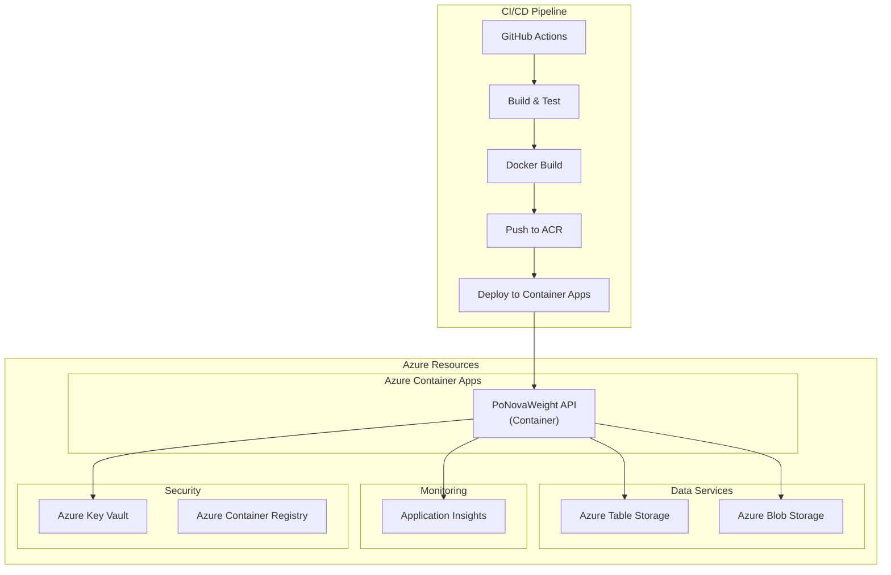

# DevOps.md - Deployment Pipeline & Environment Secrets

## PoNovaWeight DevOps Documentation

This document describes the deployment pipeline, environment configuration, and secret management for the PoNovaWeight application.

---

## REGULAR VERSION

### Azure Infrastructure Overview



### Environment Configuration

#### Configuration Priority (Highest to Lowest)
1. Environment variables
2. User secrets (development only)
3. Azure Key Vault (production)
4. appsettings.{Environment}.json
5. appsettings.json

#### Environment Variables

| Variable | Description | Required | Example |
|----------|-------------|----------|---------|
| `ASPNETCORE_ENVIRONMENT` | Runtime environment | Yes | Development, Staging, Production |
| `KeyVault:VaultUri` | Key Vault URL | Production | https://ponovaweight-kv.vault.azure.net/ |
| `PoNovaWeight:AzureStorage:ConnectionString` | Table Storage connection string | Yes | DefaultAzureCredential |
| `PoNovaWeight:AzureOpenAI:Endpoint` | OpenAI endpoint | Optional | https://ponovaopenai.openai.azure.com/ |
| `PoNovaWeight:AzureOpenAI:ApiKey` | OpenAI API key | Optional | From Key Vault |
| `DataProtection:BlobUri` | Blob storage for data protection keys | Production | https://ponovaweight.blob.core.windows.net/keys |

#### Azure Key Vault Secrets

| Secret Name | Description | Required |
|-------------|-------------|----------|
| `AzureStorage--ConnectionString` | Table/BLOB storage connection string | Yes |
| `GoogleAuth--ClientId` | Google OAuth Client ID | Yes |
| `GoogleAuth--ClientSecret` | Google OAuth Client Secret | Yes |
| `AzureOpenAI--ApiKey` | OpenAI API key | Optional |

### Deployment Pipeline

#### GitHub Actions Workflow

```mermaid
flowchart LR
    subgraph Trigger["Trigger"]
        Push[Push to main]
        PR[PR to main]
    end
    
    subgraph Build["Build Stage"]
        Checkout[Checkout code]
        Setup[Setup .NET 10]
        Restore[Restore packages]
        Build[Build solution]
        Test[Run tests]
    end
    
    subgraph Docker["Docker Stage"]
        BuildImage[Build Docker image]
        PushImage[Push to ACR]
        TagImage[Tag version]
    end
    
    subgraph Deploy["Deploy Stage"]
        Bicep[Deploy Bicep]
        UpdateContainer[Update Container App]
        HealthCheck[Health check]
    end
    
    Trigger --> Checkout
    Checkout --> Restore
    Restore --> Build
    Build --> Test
    Test --> BuildImage
    BuildImage --> TagImage
    TagImage --> PushImage
    PushImage --> Bicep
    Bicep --> UpdateContainer
    UpdateContainer --> HealthCheck
```

#### Bicep Deployment

```bash
# Deploy infrastructure
az deployment group create \
  --resource-group ponovaweight-rg \
  --template-file infra/main.bicep \
  --parameters \
    environmentName=prod \
    location=eastus \
    baseName=ponovaweight \
    googleClientId=$GOOGLE_CLIENT_ID \
    googleClientSecret=$GOOGLE_CLIENT_SECRET \
    openAiEndpoint=$OPENAI_ENDPOINT \
    openAiApiKey=$OPENAI_API_KEY
```

### Container Apps Configuration

```yaml
# Container App Environment Variables
- name: ASPNETCORE_ENVIRONMENT
  value: Production
- name: KeyVault__VaultUri
  value: https://ponovaweight-kv.vault.azure.net/
- name: PoNovaWeight__AzureStorage__ConnectionString
  secretRef: AzureStorage--ConnectionString
- name: PoNovaWeight__AzureOpenAI__Endpoint
  value: https://ponovaopenai.openai.azure.com/
- name: PoNovaWeight__AzureOpenAI__ApiKey
  secretRef: AzureOpenAI--ApiKey
```

### Local Development Secrets

#### User Secrets (Development Only)

```json
{
  "AzureStorage": {
    "ConnectionString": "UseDevelopmentStorage=true"
  },
  "GoogleAuth": {
    "ClientId": "your-client-id",
    "ClientSecret": "your-client-secret"
  },
  "AzureOpenAI": {
    "Endpoint": "https://your-openai.openai.azure.com/",
    "ApiKey": "your-api-key"
  }
}
```

#### Azure Authentication

The application uses `DefaultAzureCredential` which supports:
- Local Development: Azure CLI, Visual Studio, VS Code credentials
- Production: Managed Identity

### Health Checks

| Endpoint | Purpose | Expected Response |
|----------|---------|-------------------|
| `/health` | Liveness probe | 200 OK if app is running |
| `/alive` | Readiness probe | 200 OK if ready to serve |

### Monitoring & Observability

#### Application Insights Configuration

```yaml
# Application Insights
- Instrumentation Key: From App Insights resource
- Telemetry: Requests, dependencies, exceptions, traces
- Sampling: Adaptive sampling enabled
```

#### Log Configuration

```csharp
// Serilog configuration
Log.Logger = new LoggerConfiguration()
    .MinimumLevel.Information()
    .WriteTo.Console()
    .WriteTo.File("logs/bootstrap-.txt", rollingInterval: RollingInterval.Day)
    .CreateBootstrapLogger();
```

---

## SIMPLIFIED VERSION

### Quick Deploy

```bash
# 1. Build and test
dotnet build
dotnet test

# 2. Build Docker image
docker build -f src/PoNovaWeight.Api/Dockerfile -t ponovaweight:latest .

# 3. Push to ACR
az acr build --registry ponovaweightacr --image ponovaweight:latest .

# 4. Deploy infrastructure
az deployment group create --resource-group ponovaweight-rg --template-file infra/main.bicep
```

### Environment Setup

| Environment | How to Run | Auth |
|-------------|------------|------|
| Local | `dotnet run --project src/PoNovaWeight.AppHost` | User Secrets |
| Dev | Azure Container Apps (dev) | Key Vault |
| Prod | Azure Container Apps (prod) | Key Vault |

### Secrets Needed

| Secret | Where to Get | Required |
|--------|--------------|----------|
| Google Client ID | Google Cloud Console | Yes |
| Google Client Secret | Google Cloud Console | Yes |
| Storage Connection String | Azure Portal | Yes |
| OpenAI API Key | Azure Portal | Optional |

### Key Vault Access

- **Local**: Uses Azure CLI credentials
- **Production**: Uses System Assigned Managed Identity

### Health Check

```
GET /health
GET /alive
```

Both return 200 OK when healthy.
