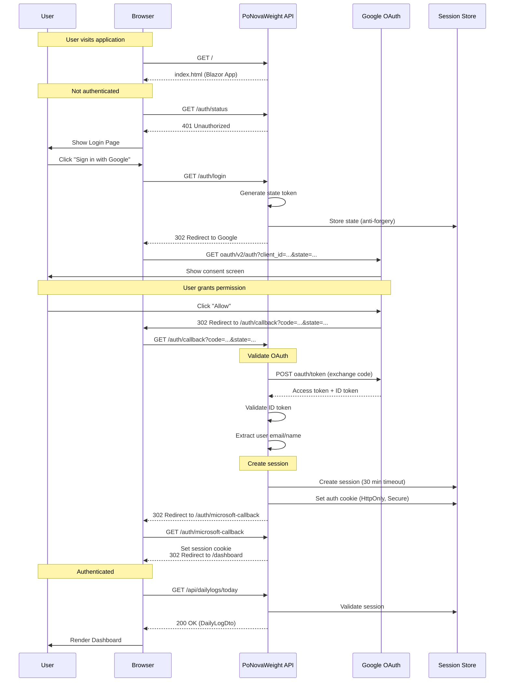
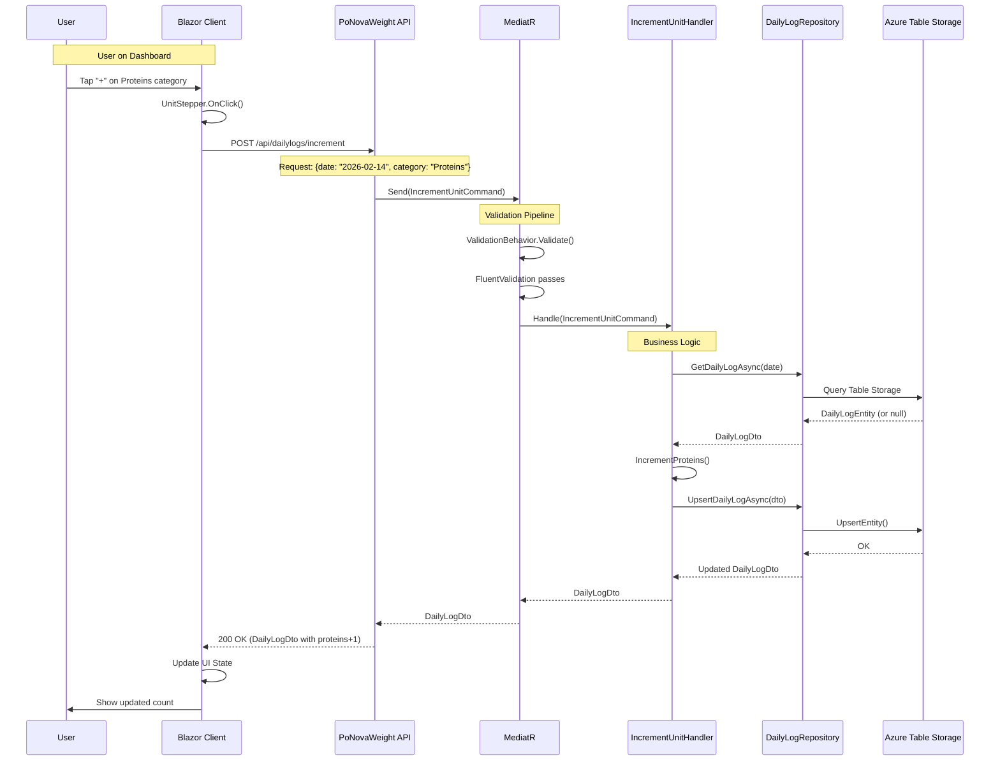
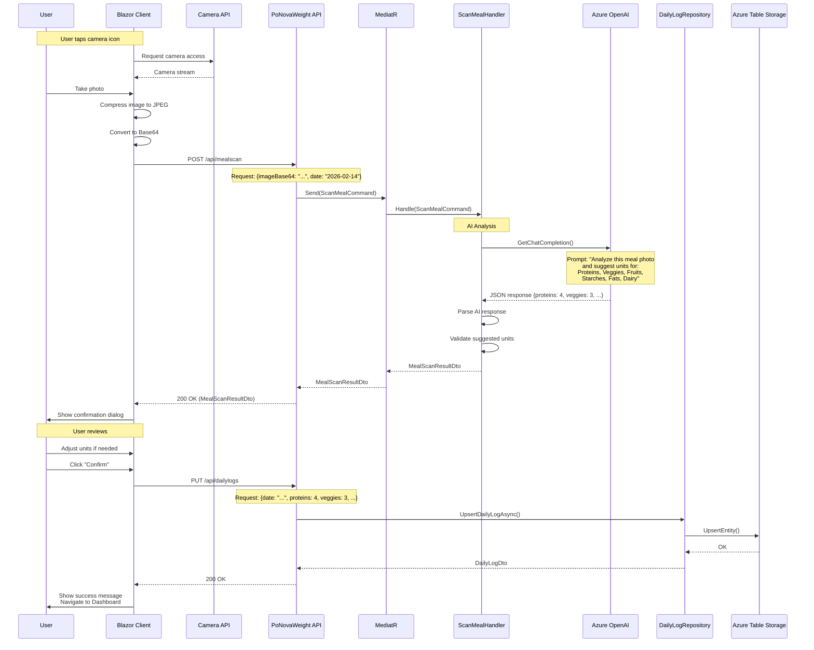
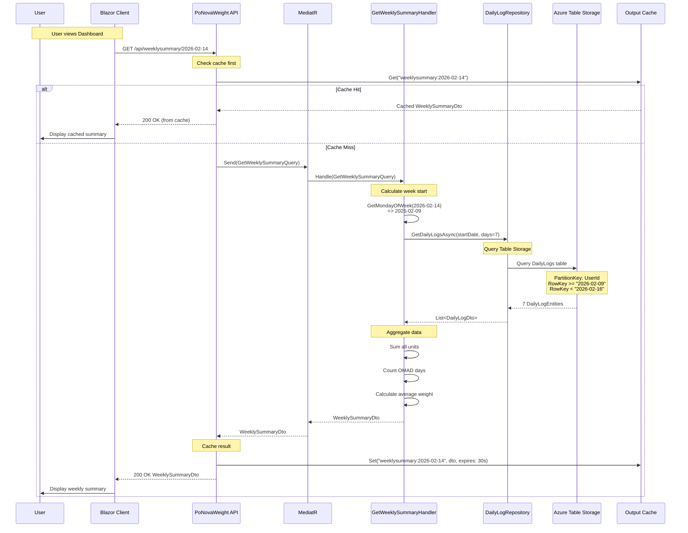
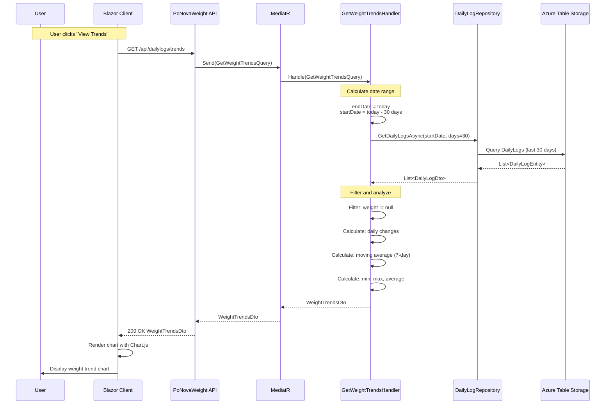
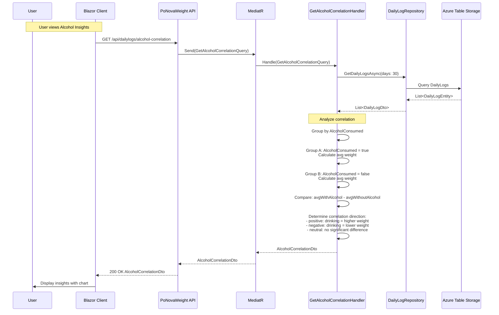
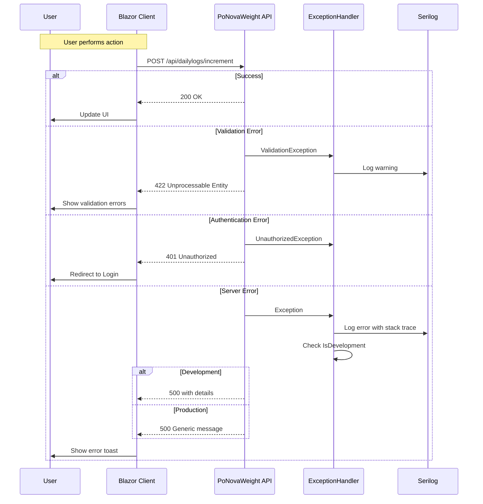
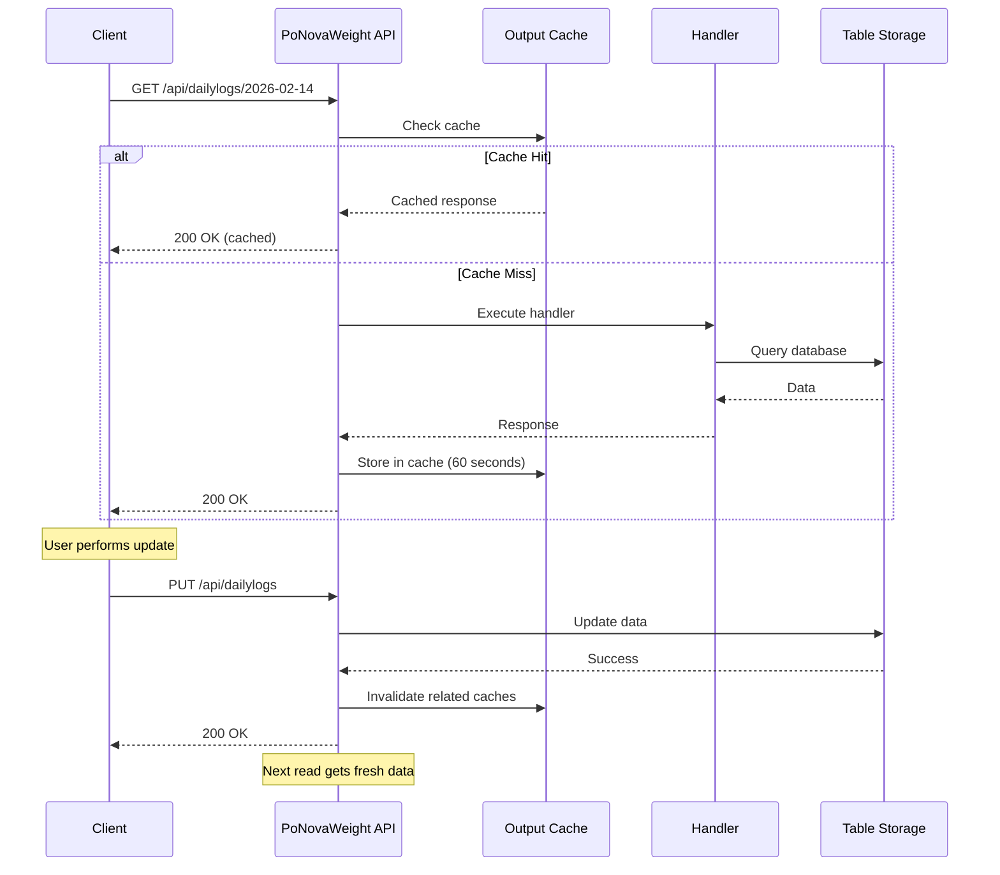

# Detailed Sequence Diagrams

## Key User Flows

This document provides detailed sequence diagrams for the main user interactions in PoNovaWeight.

---

## 1. OAuth Authentication Flow (Detailed)

---

## 2. Add Food Unit Flow

---

## 3. Meal Scanning Flow (AI)

---

## 4. Weekly Summary Aggregation Flow

---

## 5. Weight Trends Analysis Flow

---

## 6. Alcohol Correlation Analysis Flow

---

## Error Handling Flow

---

## Caching Flow

