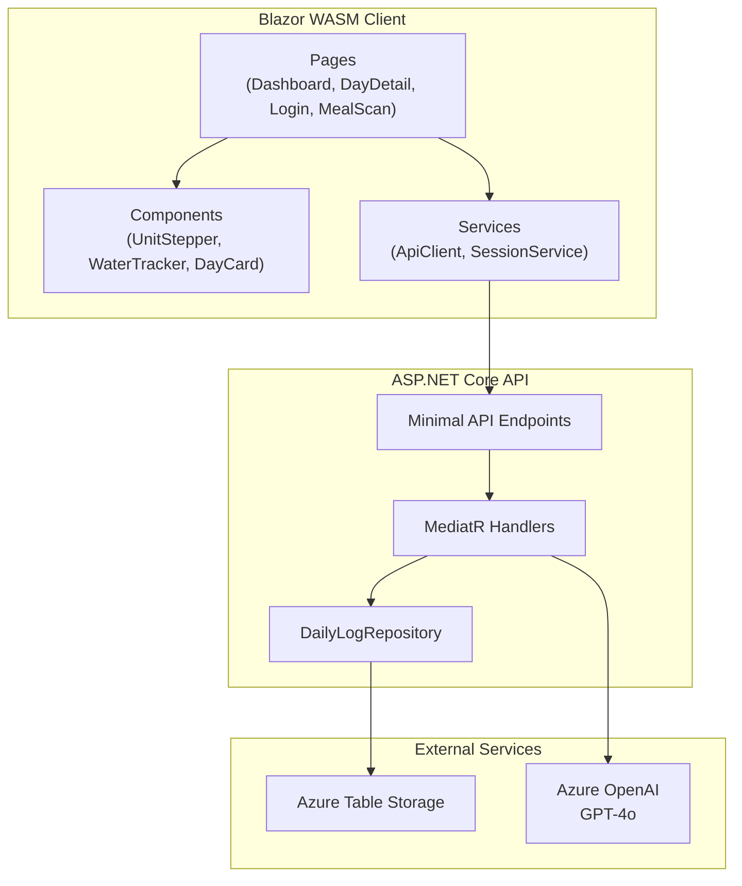
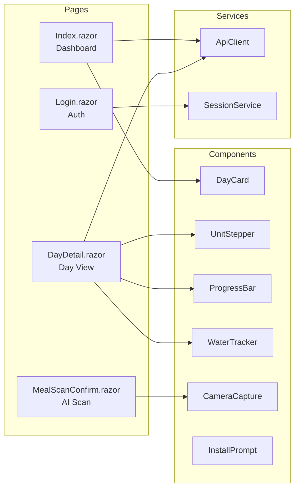
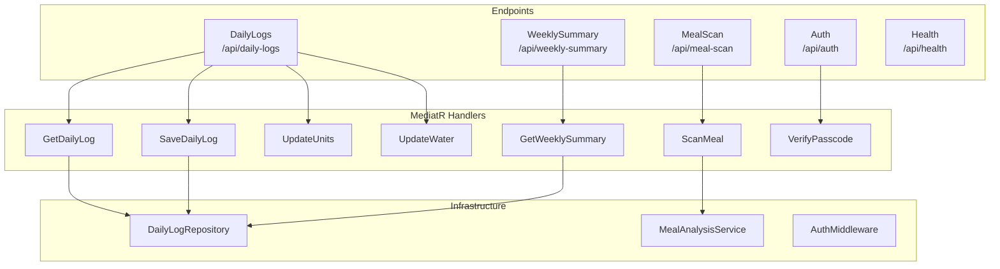
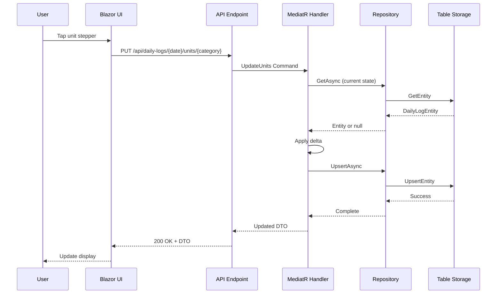
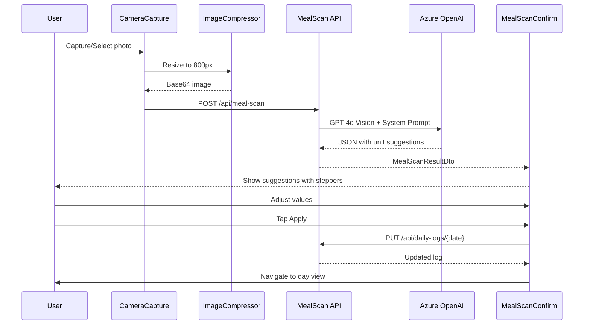
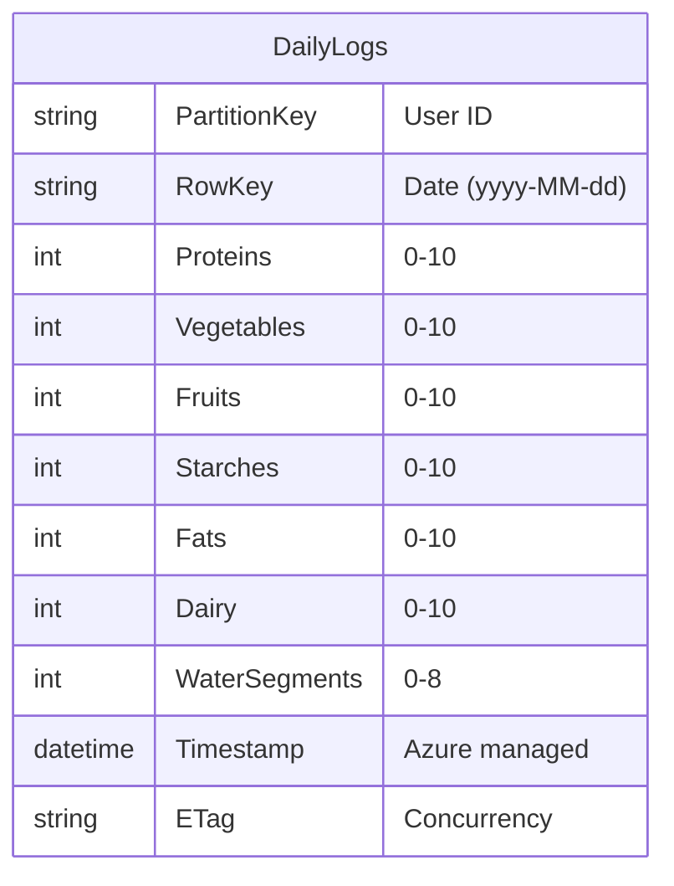
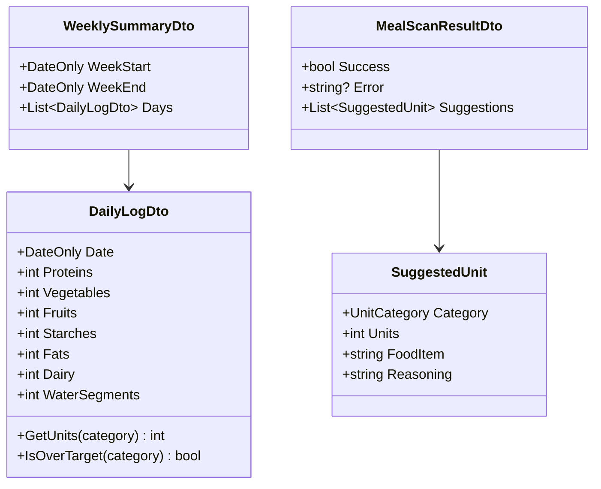
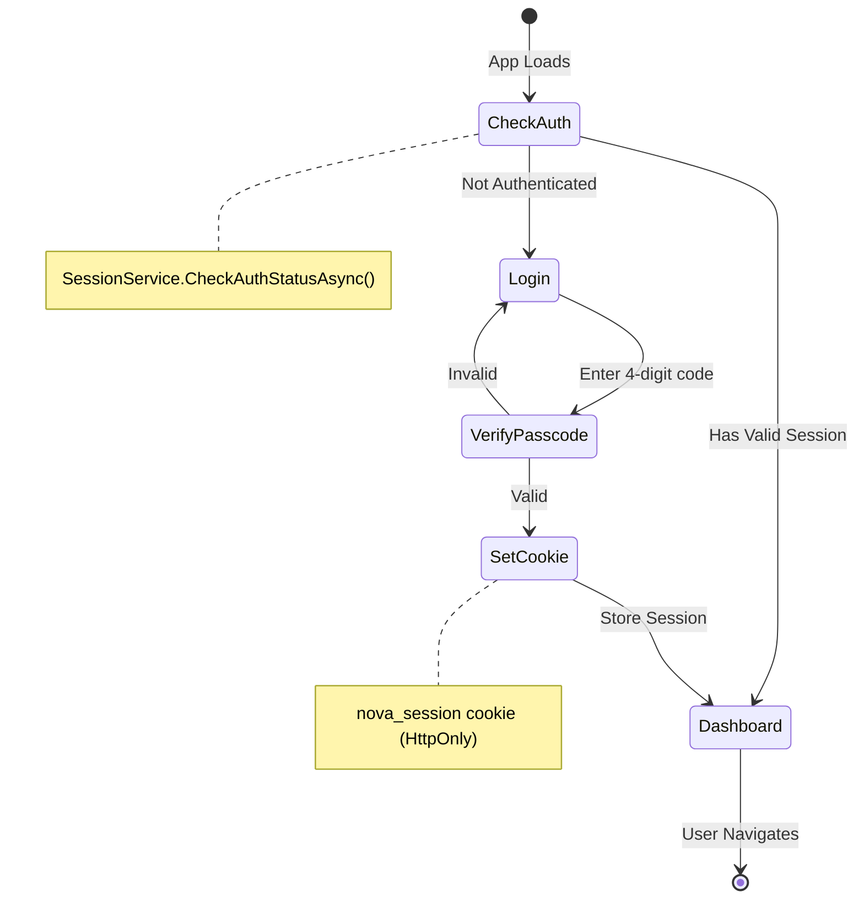
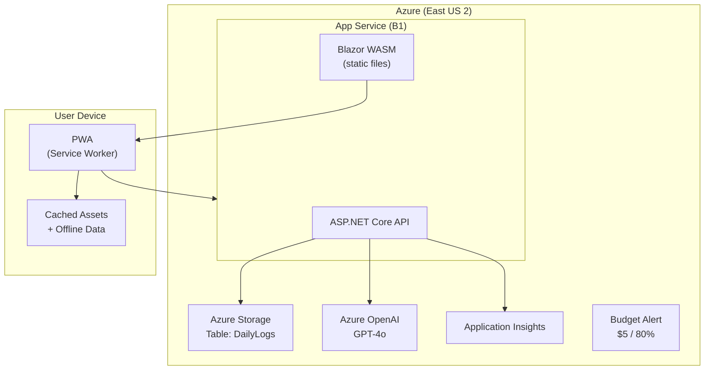

# Nova Food Journal - Architecture

## System Overview

The Nova Food Journal is a Progressive Web App (PWA) built with Blazor WebAssembly for the frontend and ASP.NET Core Minimal API for the backend. It follows a Clean Architecture pattern with feature-based organization.

## Component Architecture

### Frontend (Blazor WASM)

### Backend (ASP.NET Core)

## Data Flow

### Daily Log Flow

### AI Meal Scan Flow

## Data Model

### Azure Table Storage Schema

### DTO Structure

## Authentication Flow

## Deployment Architecture

## Technology Decisions

| Decision | Choice | Rationale |
|----------|--------|-----------|
| Frontend | Blazor WASM | Single language (C#), strong typing, component model |
| Backend | Minimal API | Lightweight, fast startup, simple routing |
| Database | Azure Table Storage | Low cost, simple key-value access, MVP appropriate |
| CQRS | MediatR | Clean handler separation, testability |
| Validation | FluentValidation | Expressive rules, easy testing |
| Testing | xUnit + bUnit + Moq | Standard .NET testing stack |
| AI | Azure OpenAI GPT-4o | Vision capability, enterprise compliance |

## Security Considerations

1. **Passcode Protection**: Simple 4-digit code prevents unauthorized access
2. **Session Cookies**: HttpOnly, Secure, SameSite=Strict cookies
3. **Single User MVP**: No multi-tenant concerns for initial release
4. **API Protection**: AuthMiddleware validates session on protected routes
5. **AI Cost Control**: Passcode gates access to AI features

## Performance Considerations

1. **PWA Caching**: Service worker caches static assets and API responses
2. **Image Compression**: Client-side resize before AI upload (800px max)
3. **Lazy Loading**: Blazor WASM assemblies loaded on demand
4. **Table Storage**: O(1) lookups via PartitionKey + RowKey
5. **Minimal API**: Reduced overhead vs. full MVC controllers
