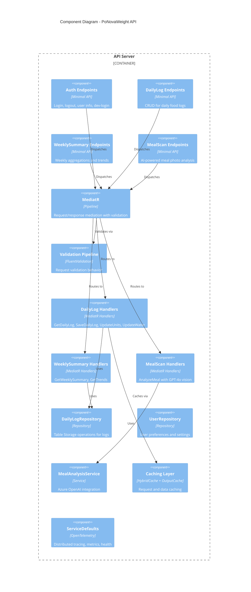
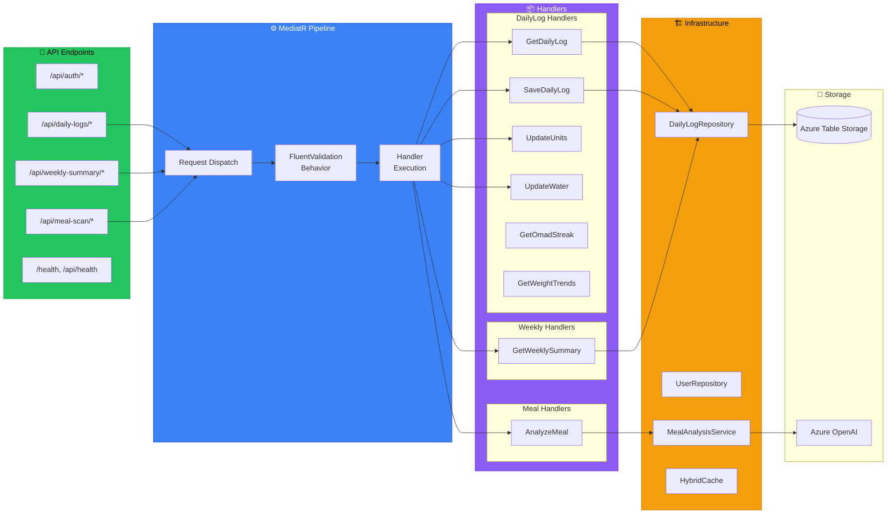

# C4 Component Diagram - API Server

## API Component Architecture

Shows the internal components of the ASP.NET Core API server.

```mermaid
C4Component
    title Component Diagram - PoNovaWeight API

    Container_Boundary(api, "API Server") {
        Component(authEndpoints, "Auth Endpoints", "Minimal API", "Login, logout, user info, dev-login")
        Component(dailyLogEndpoints, "DailyLog Endpoints", "Minimal API", "CRUD for daily food logs")
        Component(weeklyEndpoints, "WeeklySummary Endpoints", "Minimal API", "Weekly aggregations and trends")
        Component(mealScanEndpoints, "MealScan Endpoints", "Minimal API", "AI-powered meal photo analysis")
        
        Component(mediatr, "MediatR", "Pipeline", "Request/response mediation with validation")
        Component(validation, "Validation Pipeline", "FluentValidation", "Request validation behavior")
        
        Component(dailyLogHandlers, "DailyLog Handlers", "MediatR Handlers", "GetDailyLog, SaveDailyLog, UpdateUnits, UpdateWater")
        Component(weeklyHandlers, "WeeklySummary Handlers", "MediatR Handlers", "GetWeeklySummary, GetTrends")
        Component(mealHandlers, "MealScan Handlers", "MediatR Handlers", "AnalyzeMeal with GPT-4o vision")
        
        Component(dailyLogRepo, "DailyLogRepository", "Repository", "Table Storage operations for logs")
        Component(userRepo, "UserRepository", "Repository", "User preferences and settings")
        Component(mealService, "MealAnalysisService", "Service", "Azure OpenAI integration")
        
        Component(cache, "Caching Layer", "HybridCache + OutputCache", "Request and data caching")
        Component(otel, "ServiceDefaults", "OpenTelemetry", "Distributed tracing, metrics, health")
    }

    Rel(authEndpoints, mediatr, "Dispatches")
    Rel(dailyLogEndpoints, mediatr, "Dispatches")
    Rel(weeklyEndpoints, mediatr, "Dispatches")
    Rel(mealScanEndpoints, mediatr, "Dispatches")
    
    Rel(mediatr, validation, "Validates via")
    Rel(mediatr, dailyLogHandlers, "Routes to")
    Rel(mediatr, weeklyHandlers, "Routes to")
    Rel(mediatr, mealHandlers, "Routes to")
    
    Rel(dailyLogHandlers, dailyLogRepo, "Uses")
    Rel(weeklyHandlers, dailyLogRepo, "Uses")
    Rel(mealHandlers, mealService, "Uses")
    
    Rel(dailyLogHandlers, cache, "Caches via")
```

## Component Flow Diagram

```mermaid
graph LR
    subgraph Endpoints["🔌 API Endpoints"]
        Auth["/api/auth/*"]
        DailyLogs["/api/daily-logs/*"]
        Weekly["/api/weekly-summary/*"]
        MealScan["/api/meal-scan/*"]
        Health["/health, /api/health"]
    end

    subgraph Pipeline["⚙️ MediatR Pipeline"]
        Dispatch["Request Dispatch"]
        Validate["FluentValidation<br/>Behavior"]
        Handle["Handler<br/>Execution"]
    end

    subgraph Handlers["📦 Handlers"]
        subgraph DailyLogH["DailyLog Handlers"]
            GetLog["GetDailyLog"]
            SaveLog["SaveDailyLog"]
            UpdateUnits["UpdateUnits"]
            UpdateWater["UpdateWater"]
            GetStreak["GetOmadStreak"]
            GetTrends["GetWeightTrends"]
        end
        subgraph WeeklyH["Weekly Handlers"]
            GetWeekly["GetWeeklySummary"]
        end
        subgraph MealH["Meal Handlers"]
            Analyze["AnalyzeMeal"]
        end
    end

    subgraph Infrastructure["🏗️ Infrastructure"]
        DailyRepo["DailyLogRepository"]
        UserRepo["UserRepository"]
        MealSvc["MealAnalysisService"]
        Cache["HybridCache"]
    end

    subgraph Storage["💾 Storage"]
        TableStorage[(Azure Table Storage)]
        OpenAI[Azure OpenAI]
    end

    DailyLogs --> Dispatch
    Weekly --> Dispatch
    MealScan --> Dispatch
    
    Dispatch --> Validate --> Handle
    
    Handle --> GetLog & SaveLog & UpdateUnits & UpdateWater
    Handle --> GetWeekly
    Handle --> Analyze
    
    GetLog & SaveLog --> DailyRepo --> TableStorage
    GetWeekly --> DailyRepo
    Analyze --> MealSvc --> OpenAI

    style Endpoints fill:#22c55e,stroke:#16a34a,color:#000
    style Pipeline fill:#3b82f6,stroke:#1d4ed8,color:#fff
    style Handlers fill:#8b5cf6,stroke:#6d28d9,color:#fff
    style Infrastructure fill:#f59e0b,stroke:#d97706,color:#000
```
