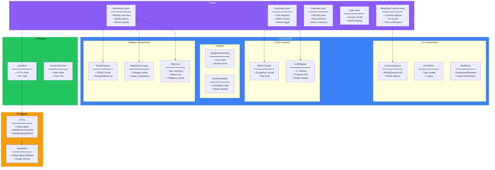
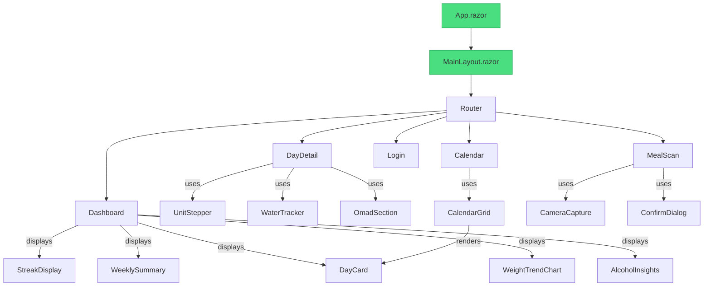

# C4 Component Diagram - Blazor Client

## Client Component Architecture

Shows the internal components of the Blazor WebAssembly client.

```mermaid
graph TB
    subgraph Pages["📄 Pages"]
        Dashboard["Dashboard.razor<br/>━━━━━━━━━━━━━━<br/>• Weekly overview<br/>• Quick actions<br/>• Streak display"]
        DayDetail["DayDetail.razor<br/>━━━━━━━━━━━━━━<br/>• Unit steppers<br/>• Water tracker<br/>• OMAD toggle"]
        Calendar["Calendar.razor<br/>━━━━━━━━━━━━━━<br/>• Monthly view<br/>• Day selection<br/>• Status indicators"]
        Login["Login.razor<br/>━━━━━━━━━━━━━━<br/>• Google OAuth<br/>• Brand display"]
        MealScan["MealScanConfirm.razor<br/>━━━━━━━━━━━━━━<br/>• Camera capture<br/>• AI results<br/>• Unit confirmation"]
    end

    subgraph Components["🧩 Components"]
        subgraph Tracking["Food Tracking"]
            UnitStepper["UnitStepper<br/>━━━━━━━━━━━━━━<br/>• +/- buttons<br/>• Progress bar<br/>• Target display"]
            WaterTracker["WaterTracker<br/>━━━━━━━━━━━━━━<br/>• 8-segment visual<br/>• Tap to fill"]
        end
        
        subgraph Display["Display Components"]
            DayCard["DayCard<br/>━━━━━━━━━━━━━━<br/>• Day summary<br/>• Status icon<br/>• Category counts"]
            WeeklySummary["WeeklySummary<br/>━━━━━━━━━━━━━━<br/>• Category totals<br/>• Target comparison"]
            StreakDisplay["StreakDisplay<br/>━━━━━━━━━━━━━━<br/>• OMAD streak<br/>• Fire/seedling icon"]
        end
        
        subgraph Insights["Insights"]
            WeightTrendChart["WeightTrendChart<br/>━━━━━━━━━━━━━━<br/>• Line chart<br/>• 30-day trend"]
            AlcoholInsights["AlcoholInsights<br/>━━━━━━━━━━━━━━<br/>• Correlation data<br/>• Impact display"]
        end
        
        subgraph UI["UI Components"]
            CameraCapture["CameraCapture<br/>━━━━━━━━━━━━━━<br/>• MediaDevices API<br/>• Photo capture"]
            UserMenu["UserMenu<br/>━━━━━━━━━━━━━━<br/>• User avatar<br/>• Logout"]
            Skeletons["Skeletons<br/>━━━━━━━━━━━━━━<br/>• DashboardSkeleton<br/>• DayCardSkeleton"]
        end
    end

    subgraph Services["🔧 Services"]
        ApiClient["ApiClient<br/>━━━━━━━━━━━━━━<br/>• HTTP client<br/>• API calls"]
        SessionService["SessionService<br/>━━━━━━━━━━━━━━<br/>• Auth state<br/>• User info"]
    end

    subgraph Shared["📦 Shared"]
        DTOs["DTOs<br/>━━━━━━━━━━━━━━<br/>• DailyLogDto<br/>• WeeklySummaryDto<br/>• MealAnalysisResult"]
        Validators["Validators<br/>━━━━━━━━━━━━━━<br/>• DailyLogDtoValidator<br/>• Range checks"]
    end

    Dashboard --> DayCard & WeeklySummary & StreakDisplay
    DayDetail --> UnitStepper & WaterTracker
    MealScan --> CameraCapture
    
    Pages --> ApiClient
    ApiClient --> DTOs
    DTOs --> Validators

    style Pages fill:#8b5cf6,stroke:#6d28d9,color:#fff
    style Components fill:#3b82f6,stroke:#1d4ed8,color:#fff
    style Services fill:#22c55e,stroke:#16a34a,color:#000
    style Shared fill:#f59e0b,stroke:#d97706,color:#000
```

## Component Hierarchy

```mermaid
graph TD
    App["App.razor"] --> MainLayout["MainLayout.razor"]
    MainLayout --> Router["Router"]
    
    Router --> Dashboard
    Router --> DayDetail
    Router --> Calendar
    Router --> Login
    Router --> MealScan

    Dashboard --> |"displays"| StreakDisplay
    Dashboard --> |"displays"| WeeklySummary
    Dashboard --> |"displays"| DayCard
    Dashboard --> |"displays"| WeightTrendChart
    Dashboard --> |"displays"| AlcoholInsights
    
    DayDetail --> |"uses"| UnitStepper
    DayDetail --> |"uses"| WaterTracker
    DayDetail --> |"uses"| OmadSection
    
    Calendar --> |"uses"| CalendarGrid
    CalendarGrid --> |"renders"| DayCard
    
    MealScan --> |"uses"| CameraCapture
    MealScan --> |"uses"| ConfirmDialog

    style App fill:#4ade80,stroke:#16a34a
    style MainLayout fill:#4ade80,stroke:#16a34a
```
