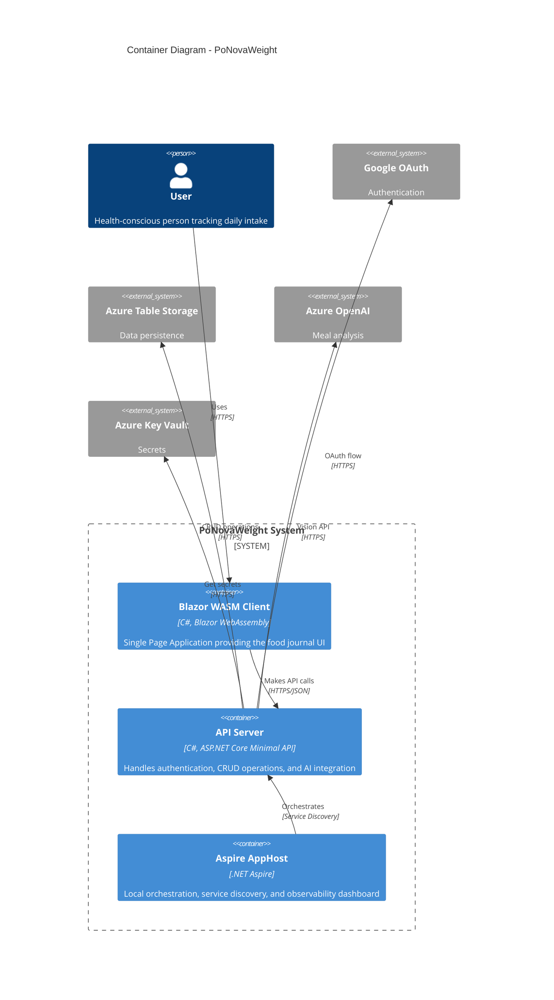
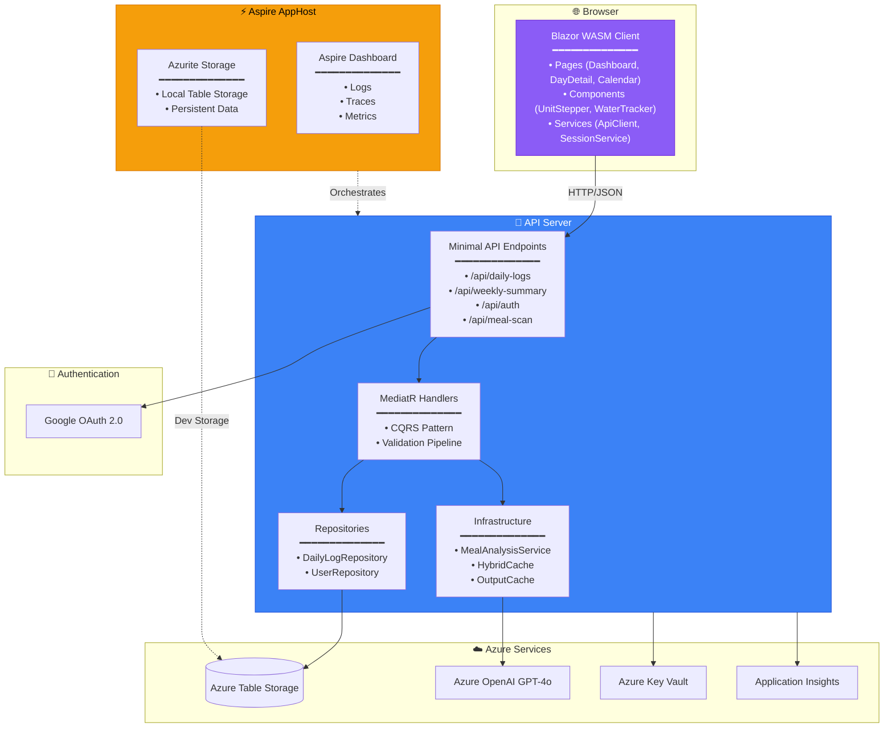

# C4 Container Diagram - PoNovaWeight

## Container View

Shows the high-level technical building blocks of the PoNovaWeight system.

```mermaid
C4Container
    title Container Diagram - PoNovaWeight

    Person(user, "User", "Health-conscious person tracking daily intake")

    System_Boundary(ponovaweight, "PoNovaWeight System") {
        Container(blazor, "Blazor WASM Client", "C#, Blazor WebAssembly", "Single Page Application providing the food journal UI")
        Container(api, "API Server", "C#, ASP.NET Core Minimal API", "Handles authentication, CRUD operations, and AI integration")
        Container(aspire, "Aspire AppHost", ".NET Aspire", "Local orchestration, service discovery, and observability dashboard")
    }

    System_Ext(google, "Google OAuth", "Authentication")
    System_Ext(storage, "Azure Table Storage", "Data persistence")
    System_Ext(openai, "Azure OpenAI", "Meal analysis")
    System_Ext(keyvault, "Azure Key Vault", "Secrets")

    Rel(user, blazor, "Uses", "HTTPS")
    Rel(blazor, api, "Makes API calls", "HTTPS/JSON")
    Rel(aspire, api, "Orchestrates", "Service Discovery")
    Rel(api, google, "OAuth flow", "HTTPS")
    Rel(api, storage, "CRUD operations", "HTTPS")
    Rel(api, openai, "Vision API", "HTTPS")
    Rel(api, keyvault, "Get secrets", "HTTPS")
```

## Detailed Container View

```mermaid
graph TB
    subgraph Browser["🌐 Browser"]
        Blazor["Blazor WASM Client<br/>━━━━━━━━━━━━━━<br/>• Pages (Dashboard, DayDetail, Calendar)<br/>• Components (UnitStepper, WaterTracker)<br/>• Services (ApiClient, SessionService)"]
    end

    subgraph AspireHost["⚡ Aspire AppHost"]
        Dashboard["Aspire Dashboard<br/>━━━━━━━━━━━━━━<br/>• Logs<br/>• Traces<br/>• Metrics"]
        Azurite["Azurite Storage<br/>━━━━━━━━━━━━━━<br/>• Local Table Storage<br/>• Persistent Data"]
    end

    subgraph APIServer["🔧 API Server"]
        Endpoints["Minimal API Endpoints<br/>━━━━━━━━━━━━━━<br/>• /api/daily-logs<br/>• /api/weekly-summary<br/>• /api/auth<br/>• /api/meal-scan"]
        Handlers["MediatR Handlers<br/>━━━━━━━━━━━━━━<br/>• CQRS Pattern<br/>• Validation Pipeline"]
        Repos["Repositories<br/>━━━━━━━━━━━━━━<br/>• DailyLogRepository<br/>• UserRepository"]
        Services["Infrastructure<br/>━━━━━━━━━━━━━━<br/>• MealAnalysisService<br/>• HybridCache<br/>• OutputCache"]
    end

    subgraph Azure["☁️ Azure Services"]
        TableStorage[(Azure Table Storage)]
        OpenAI[Azure OpenAI GPT-4o]
        KeyVault[Azure Key Vault]
        AppInsights[Application Insights]
    end

    subgraph Auth["🔐 Authentication"]
        Google[Google OAuth 2.0]
    end

    Blazor -->|HTTP/JSON| Endpoints
    Endpoints --> Handlers
    Handlers --> Repos
    Handlers --> Services
    Repos --> TableStorage
    Services --> OpenAI
    APIServer --> KeyVault
    APIServer --> AppInsights
    Endpoints --> Google
    AspireHost -.->|Orchestrates| APIServer
    Azurite -.->|Dev Storage| TableStorage

    style Blazor fill:#8b5cf6,stroke:#6d28d9,color:#fff
    style APIServer fill:#3b82f6,stroke:#1d4ed8,color:#fff
    style AspireHost fill:#f59e0b,stroke:#d97706,color:#000
```
