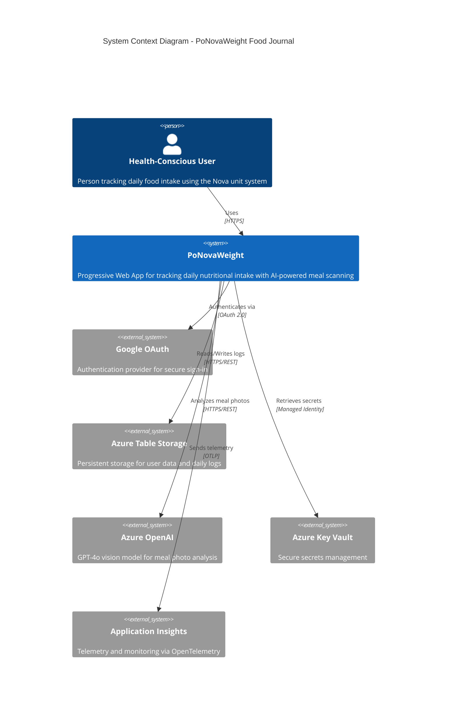
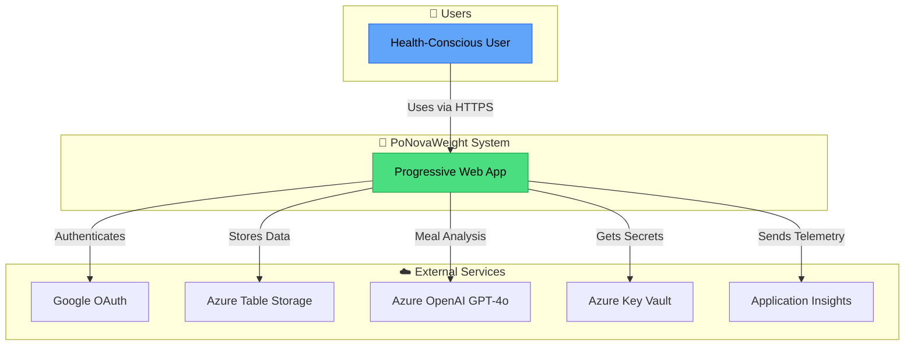

# C4 Context Diagram - PoNovaWeight

## System Context

Shows how PoNovaWeight fits into the larger ecosystem and interacts with external systems.

```mermaid
C4Context
    title System Context Diagram - PoNovaWeight Food Journal

    Person(user, "Health-Conscious User", "Person tracking daily food intake using the Nova unit system")
    
    System(ponovaweight, "PoNovaWeight", "Progressive Web App for tracking daily nutritional intake with AI-powered meal scanning")
    
    System_Ext(google, "Google OAuth", "Authentication provider for secure sign-in")
    System_Ext(azurestorage, "Azure Table Storage", "Persistent storage for user data and daily logs")
    System_Ext(openai, "Azure OpenAI", "GPT-4o vision model for meal photo analysis")
    System_Ext(keyvault, "Azure Key Vault", "Secure secrets management")
    System_Ext(appinsights, "Application Insights", "Telemetry and monitoring via OpenTelemetry")

    Rel(user, ponovaweight, "Uses", "HTTPS")
    Rel(ponovaweight, google, "Authenticates via", "OAuth 2.0")
    Rel(ponovaweight, azurestorage, "Reads/Writes logs", "HTTPS/REST")
    Rel(ponovaweight, openai, "Analyzes meal photos", "HTTPS/REST")
    Rel(ponovaweight, keyvault, "Retrieves secrets", "Managed Identity")
    Rel(ponovaweight, appinsights, "Sends telemetry", "OTLP")
```

## Simplified View

```mermaid
graph TB
    subgraph Users["👤 Users"]
        User[Health-Conscious User]
    end

    subgraph PoNovaWeight["🥗 PoNovaWeight System"]
        PWA[Progressive Web App]
    end

    subgraph External["☁️ External Services"]
        Google[Google OAuth]
        Storage[Azure Table Storage]
        OpenAI[Azure OpenAI GPT-4o]
        KeyVault[Azure Key Vault]
        AppInsights[Application Insights]
    end

    User -->|Uses via HTTPS| PWA
    PWA -->|Authenticates| Google
    PWA -->|Stores Data| Storage
    PWA -->|Meal Analysis| OpenAI
    PWA -->|Gets Secrets| KeyVault
    PWA -->|Sends Telemetry| AppInsights

    style PWA fill:#4ade80,stroke:#16a34a,color:#000
    style User fill:#60a5fa,stroke:#2563eb,color:#000
```
