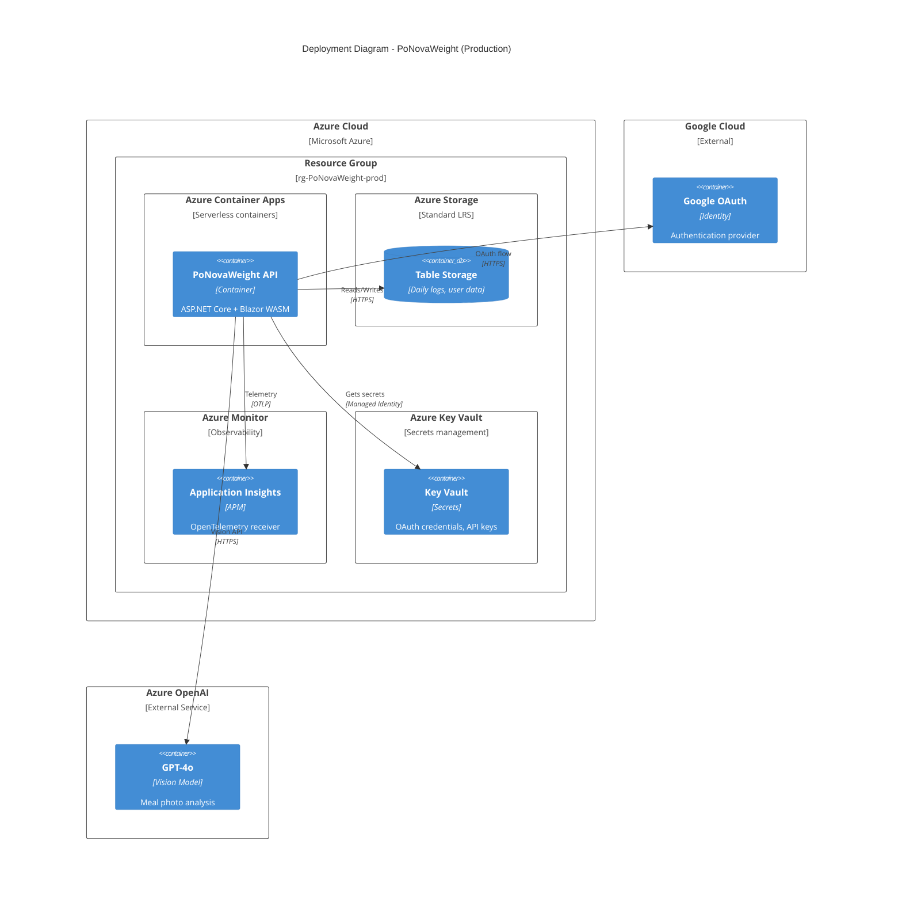
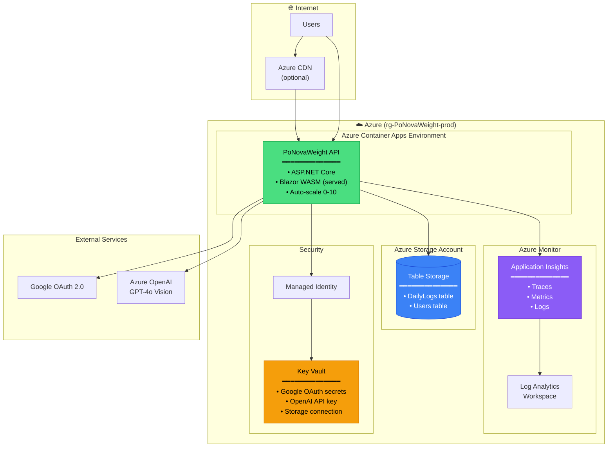
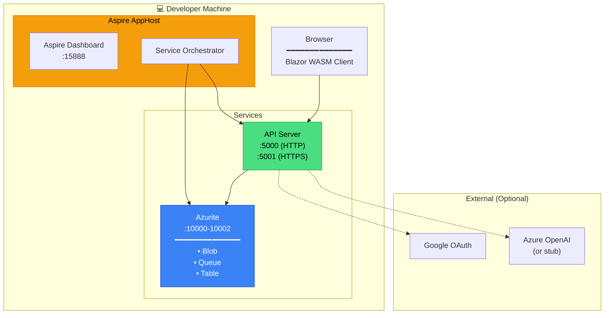

# C4 Deployment Diagram - PoNovaWeight

## Azure Deployment Architecture

Shows the physical deployment topology in Azure.

```mermaid
C4Deployment
    title Deployment Diagram - PoNovaWeight (Production)

    Deployment_Node(azure, "Azure Cloud", "Microsoft Azure") {
        Deployment_Node(rg, "Resource Group", "rg-PoNovaWeight-prod") {
            Deployment_Node(aca, "Azure Container Apps", "Serverless containers") {
                Container(api, "PoNovaWeight API", "Container", "ASP.NET Core + Blazor WASM")
            }
            
            Deployment_Node(storage, "Azure Storage", "Standard LRS") {
                ContainerDb(tables, "Table Storage", "Daily logs, user data")
            }
            
            Deployment_Node(monitor, "Azure Monitor", "Observability") {
                Container(insights, "Application Insights", "APM", "OpenTelemetry receiver")
            }
            
            Deployment_Node(secrets, "Azure Key Vault", "Secrets management") {
                Container(kv, "Key Vault", "Secrets", "OAuth credentials, API keys")
            }
        }
    }

    Deployment_Node(google, "Google Cloud", "External") {
        Container(oauth, "Google OAuth", "Identity", "Authentication provider")
    }

    Deployment_Node(openai, "Azure OpenAI", "External Service") {
        Container(gpt, "GPT-4o", "Vision Model", "Meal photo analysis")
    }

    Rel(api, tables, "Reads/Writes", "HTTPS")
    Rel(api, insights, "Telemetry", "OTLP")
    Rel(api, kv, "Gets secrets", "Managed Identity")
    Rel(api, oauth, "OAuth flow", "HTTPS")
    Rel(api, gpt, "Vision API", "HTTPS")
```

## Infrastructure Diagram

```mermaid
graph TB
    subgraph Internet["🌐 Internet"]
        Users["Users"]
        CDN["Azure CDN<br/>(optional)"]
    end

    subgraph AzureCloud["☁️ Azure (rg-PoNovaWeight-prod)"]
        subgraph ACA["Azure Container Apps Environment"]
            API["PoNovaWeight API<br/>━━━━━━━━━━━━━━<br/>• ASP.NET Core<br/>• Blazor WASM (served)<br/>• Auto-scale 0-10"]
        end

        subgraph Storage["Azure Storage Account"]
            Tables[(Table Storage<br/>━━━━━━━━━━━━━━<br/>• DailyLogs table<br/>• Users table)]
        end

        subgraph Monitor["Azure Monitor"]
            AppInsights["Application Insights<br/>━━━━━━━━━━━━━━<br/>• Traces<br/>• Metrics<br/>• Logs"]
            LAW["Log Analytics<br/>Workspace"]
        end

        subgraph Security["Security"]
            KeyVault["Key Vault<br/>━━━━━━━━━━━━━━<br/>• Google OAuth secrets<br/>• OpenAI API key<br/>• Storage connection"]
            ManagedId["Managed Identity"]
        end
    end

    subgraph External["External Services"]
        Google["Google OAuth 2.0"]
        OpenAI["Azure OpenAI<br/>GPT-4o Vision"]
    end

    Users --> CDN --> API
    Users --> API
    API --> Tables
    API --> AppInsights --> LAW
    API --> ManagedId --> KeyVault
    API --> Google
    API --> OpenAI

    style API fill:#4ade80,stroke:#16a34a,color:#000
    style Tables fill:#3b82f6,stroke:#1d4ed8,color:#fff
    style KeyVault fill:#f59e0b,stroke:#d97706,color:#000
    style AppInsights fill:#8b5cf6,stroke:#6d28d9,color:#fff
```

## Local Development Architecture

```mermaid
graph TB
    subgraph Dev["💻 Developer Machine"]
        subgraph Aspire["Aspire AppHost"]
            Dashboard["Aspire Dashboard<br/>:15888"]
            Orchestrator["Service Orchestrator"]
        end

        subgraph Services["Services"]
            API["API Server<br/>:5000 (HTTP)<br/>:5001 (HTTPS)"]
            Azurite["Azurite<br/>:10000-10002<br/>━━━━━━━━━━━━━━<br/>• Blob<br/>• Queue<br/>• Table"]
        end

        Browser["Browser<br/>━━━━━━━━━━━━━━<br/>Blazor WASM Client"]
    end

    subgraph External["External (Optional)"]
        Google["Google OAuth"]
        OpenAI["Azure OpenAI<br/>(or stub)"]
    end

    Orchestrator --> API
    Orchestrator --> Azurite
    Browser --> API
    API --> Azurite
    API -.-> Google
    API -.-> OpenAI

    style Aspire fill:#f59e0b,stroke:#d97706,color:#000
    style API fill:#4ade80,stroke:#16a34a,color:#000
    style Azurite fill:#3b82f6,stroke:#1d4ed8,color:#fff
```
