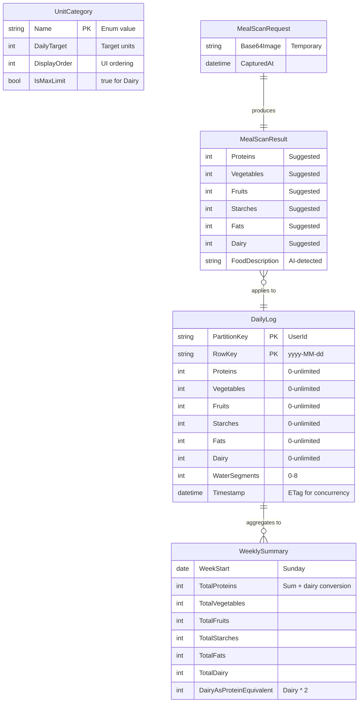
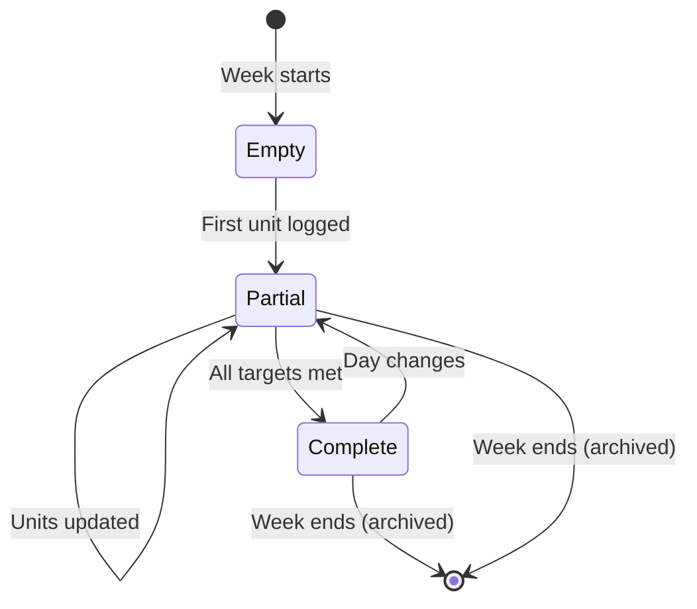
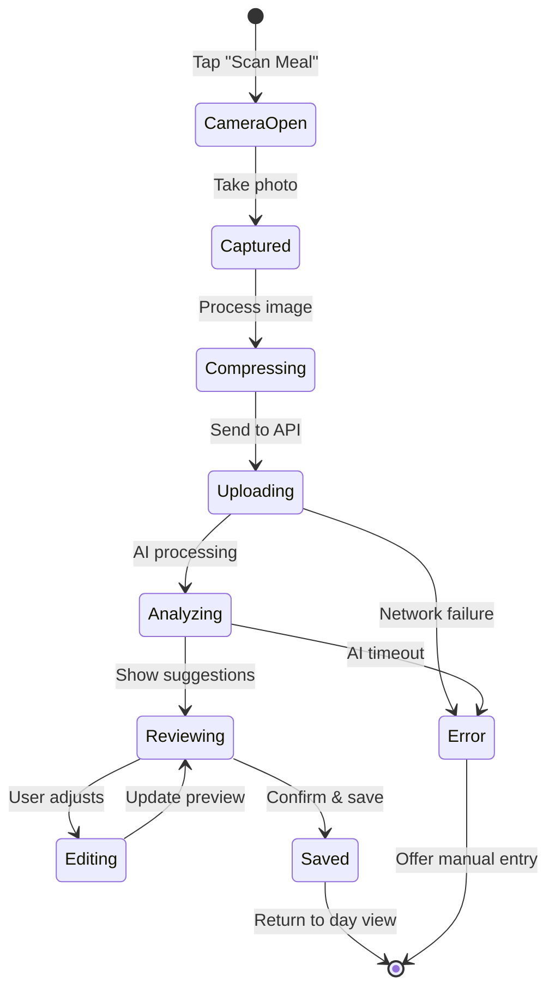

# Data Model: PoNovaWeight Food Journal MVP

**Date**: 2025-12-10  
**Branch**: `001-food-journal-mvp`

## Entity Relationship Diagram



## Azure Table Storage Schema

### Table: `DailyLogs`

| Column | Type | Description | Constraints |
|--------|------|-------------|-------------|
| `PartitionKey` | string | User identifier | `"dev-user"` for MVP |
| `RowKey` | string | Date in `yyyy-MM-dd` format | Range: current week |
| `Proteins` | int | Protein units logged | Min: 0, No max |
| `Vegetables` | int | Vegetable units logged | Min: 0, No max |
| `Fruits` | int | Fruit units logged | Min: 0, No max |
| `Starches` | int | Starch/carb units logged | Min: 0, No max |
| `Fats` | int | Fat units logged | Min: 0, No max |
| `Dairy` | int | Dairy units logged | Min: 0, No max |
| `WaterSegments` | int | Water intake (8oz segments) | 0-8 |
| `Timestamp` | datetime | Azure-managed ETag | Auto |

**Access Patterns**:
1. **Get Week**: Query by PartitionKey + RowKey range (`2025-12-08` to `2025-12-14`)
2. **Upsert Day**: InsertOrReplace by PartitionKey + RowKey

## Domain Entities (C#)

### DailyLogEntity (Table Storage)

```csharp
public class DailyLogEntity : ITableEntity
{
    public string PartitionKey { get; set; } = "dev-user";
    public string RowKey { get; set; } = string.Empty; // yyyy-MM-dd
    public DateTimeOffset? Timestamp { get; set; }
    public ETag ETag { get; set; }
    
    public int Proteins { get; set; }
    public int Vegetables { get; set; }
    public int Fruits { get; set; }
    public int Starches { get; set; }
    public int Fats { get; set; }
    public int Dairy { get; set; }
    public int WaterSegments { get; set; }
}
```

### UnitCategory (Shared Enum)

```csharp
public enum UnitCategory
{
    Proteins = 0,
    Vegetables = 1,
    Fruits = 2,
    Starches = 3,
    Fats = 4,
    Dairy = 5
}

public static class UnitCategoryInfo
{
    public static readonly IReadOnlyDictionary<UnitCategory, (int Target, bool IsMax)> Targets = 
        new Dictionary<UnitCategory, (int, bool)>
        {
            [UnitCategory.Proteins] = (15, false),
            [UnitCategory.Vegetables] = (5, false),
            [UnitCategory.Fruits] = (2, false),
            [UnitCategory.Starches] = (2, false),
            [UnitCategory.Fats] = (4, false),
            [UnitCategory.Dairy] = (3, true) // "max" not "target"
        };
    
    public const int DairyToProteinFactor = 2;
}
```

## DTOs (Shared Project)

### DailyLogDto

```csharp
public record DailyLogDto
{
    public required DateOnly Date { get; init; }
    public required int Proteins { get; init; }
    public required int Vegetables { get; init; }
    public required int Fruits { get; init; }
    public required int Starches { get; init; }
    public required int Fats { get; init; }
    public required int Dairy { get; init; }
    public required int WaterSegments { get; init; }
    
    public bool IsOverTarget(UnitCategory category) => category switch
    {
        UnitCategory.Proteins => Proteins > 15,
        UnitCategory.Vegetables => Vegetables > 5,
        UnitCategory.Fruits => Fruits > 2,
        UnitCategory.Starches => Starches > 2,
        UnitCategory.Fats => Fats > 4,
        UnitCategory.Dairy => Dairy > 3,
        _ => false
    };
}
```

### WeeklySummaryDto

```csharp
public record WeeklySummaryDto
{
    public required DateOnly WeekStart { get; init; } // Sunday
    public required DateOnly WeekEnd { get; init; }   // Saturday
    public required IReadOnlyList<DailyLogDto> Days { get; init; }
    
    public int TotalProteins => Days.Sum(d => d.Proteins);
    public int TotalVegetables => Days.Sum(d => d.Vegetables);
    public int TotalFruits => Days.Sum(d => d.Fruits);
    public int TotalStarches => Days.Sum(d => d.Starches);
    public int TotalFats => Days.Sum(d => d.Fats);
    public int TotalDairy => Days.Sum(d => d.Dairy);
    
    public int DairyAsProteinEquivalent => TotalDairy * UnitCategoryInfo.DairyToProteinFactor;
    
    // Weekly targets (daily * 7)
    public int WeeklyProteinTarget => 15 * 7; // 105
    public int WeeklyVegetableTarget => 5 * 7; // 35
    public int WeeklyFruitTarget => 2 * 7;     // 14
    public int WeeklyStarchTarget => 2 * 7;    // 14
    public int WeeklyFatTarget => 4 * 7;       // 28
    public int WeeklyDairyMax => 3 * 7;        // 21
}
```

### MealScanRequestDto

```csharp
public record MealScanRequestDto
{
    [Required]
    public required string Base64Image { get; init; }
    
    public required DateOnly TargetDate { get; init; }
}
```

### MealScanResultDto

```csharp
public record MealScanResultDto
{
    public required int Proteins { get; init; }
    public required int Vegetables { get; init; }
    public required int Fruits { get; init; }
    public required int Starches { get; init; }
    public required int Fats { get; init; }
    public required int Dairy { get; init; }
    public string? FoodDescription { get; init; }
}
```

## Validation Rules (FluentValidation)

### DailyLogValidator

```csharp
public class DailyLogDtoValidator : AbstractValidator<DailyLogDto>
{
    public DailyLogDtoValidator()
    {
        RuleFor(x => x.Date)
            .Must(BeWithinCurrentWeek)
            .WithMessage("Can only log for current week");
        
        RuleFor(x => x.Proteins).GreaterThanOrEqualTo(0);
        RuleFor(x => x.Vegetables).GreaterThanOrEqualTo(0);
        RuleFor(x => x.Fruits).GreaterThanOrEqualTo(0);
        RuleFor(x => x.Starches).GreaterThanOrEqualTo(0);
        RuleFor(x => x.Fats).GreaterThanOrEqualTo(0);
        RuleFor(x => x.Dairy).GreaterThanOrEqualTo(0);
        RuleFor(x => x.WaterSegments).InclusiveBetween(0, 8);
    }
    
    private static bool BeWithinCurrentWeek(DateOnly date)
    {
        var today = DateOnly.FromDateTime(DateTime.Today);
        var (weekStart, weekEnd) = GetWeekBounds(today);
        return date >= weekStart && date <= weekEnd;
    }
    
    private static (DateOnly Start, DateOnly End) GetWeekBounds(DateOnly date)
    {
        int diff = (7 + (date.DayOfWeek - DayOfWeek.Sunday)) % 7;
        var start = date.AddDays(-diff);
        var end = start.AddDays(6);
        return (start, end);
    }
}
```

## State Transitions

### DailyLog Lifecycle



### MealScan Workflow



## Index Strategy

Azure Table Storage uses PartitionKey + RowKey as composite primary key.

**Query Efficiency**:
- `GetWeek(userId, date)`: Single partition scan with RowKey range filter → O(7) entities max
- `UpsertDay(userId, date, log)`: Point write → O(1)

No secondary indexes needed for MVP access patterns.
