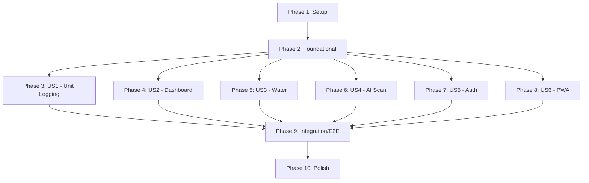

# Tasks: PoNovaWeight Food Journal MVP

**Input**: Design documents from `/specs/001-food-journal-mvp/`  
**Branch**: `001-food-journal-mvp`  
**Generated**: 2025-12-10

## Format: `[ID] [P?] [Story?] Description`

- **[P]**: Can run in parallel (different files, no dependencies on incomplete tasks)
- **[US#]**: User story label (only in user story phases)
- All paths are absolute from repository root

---

## Phase 1: Setup (Project Initialization)

**Purpose**: Create solution structure, configure build, and establish development environment

- [X] T001 Create solution file `PoNovaWeight.sln` at repository root
- [X] T002 Create `global.json` locking .NET SDK to 10.0.xxx at repository root
- [X] T003 [P] Create `Directory.Packages.props` for centralized NuGet versioning at repository root
- [X] T004 [P] Create `Directory.Build.props` with nullable enable and implicit usings at repository root
- [X] T005 Create API project `src/PoNovaWeight.Api/PoNovaWeight.Api.csproj` with Blazor hosting
- [X] T006 [P] Create Client project `src/PoNovaWeight.Client/PoNovaWeight.Client.csproj` as Blazor WASM
- [X] T007 [P] Create Shared project `src/PoNovaWeight.Shared/PoNovaWeight.Shared.csproj` for DTOs
- [X] T008 Add project references: Api → Client, Api → Shared, Client → Shared
- [X] T009 [P] Create test project `tests/PoNovaWeight.Api.Tests/PoNovaWeight.Api.Tests.csproj` with xUnit
- [X] T010 [P] Create test project `tests/PoNovaWeight.Client.Tests/PoNovaWeight.Client.Tests.csproj` with bUnit
- [X] T011 [P] Create test project `tests/PoNovaWeight.E2E/PoNovaWeight.E2E.csproj` with Playwright
- [X] T012 [P] Create `.editorconfig` with C# formatting rules at repository root
- [X] T013 [P] Create `src/PoNovaWeight.Api/appsettings.json` with placeholder configuration
- [X] T014 [P] Create `src/PoNovaWeight.Api/appsettings.Development.json` with Azurite connection string
- [X] T015 [P] Initialize Tailwind CSS in `src/PoNovaWeight.Client/` with `package.json` and `tailwind.config.js`
- [X] T016 [P] Create `.vscode/launch.json` for F5 debugging
- [X] T017 [P] Create `.vscode/tasks.json` for build/run tasks
- [X] T018 Verify solution builds with `dotnet build PoNovaWeight.sln`

---

## Phase 2: Foundational (Blocking Prerequisites)

**Purpose**: Core infrastructure required by ALL user stories - must complete before any story begins

**⚠️ CRITICAL**: No user story work can begin until this phase is complete

### Shared DTOs & Contracts

- [X] T019 Create `UnitCategory` enum in `src/PoNovaWeight.Shared/Contracts/UnitCategory.cs`
- [X] T020 [P] Create `UnitCategoryInfo` static class with targets in `src/PoNovaWeight.Shared/Contracts/UnitCategoryInfo.cs`
- [X] T021 [P] Create `DailyLogDto` record in `src/PoNovaWeight.Shared/DTOs/DailyLogDto.cs`
- [X] T022 [P] Create `WeeklySummaryDto` record in `src/PoNovaWeight.Shared/DTOs/WeeklySummaryDto.cs`
- [X] T023 [P] Create `IncrementUnitRequest` record in `src/PoNovaWeight.Shared/DTOs/IncrementUnitRequest.cs`
- [X] T024 [P] Create `UpdateWaterRequest` record in `src/PoNovaWeight.Shared/DTOs/UpdateWaterRequest.cs`

### Validation

- [X] T025 Create `DailyLogDtoValidator` with FluentValidation in `src/PoNovaWeight.Shared/Validation/DailyLogDtoValidator.cs`

### Infrastructure - Table Storage

- [X] T026 Create `DailyLogEntity` implementing `ITableEntity` in `src/PoNovaWeight.Api/Infrastructure/TableStorage/DailyLogEntity.cs`
- [X] T027 Create `IDailyLogRepository` interface in `src/PoNovaWeight.Api/Infrastructure/TableStorage/IDailyLogRepository.cs`
- [X] T028 Implement `DailyLogRepository` with Azure.Data.Tables in `src/PoNovaWeight.Api/Infrastructure/TableStorage/DailyLogRepository.cs`

### API Bootstrap

- [X] T029 Configure services in `src/PoNovaWeight.Api/Program.cs` (MediatR, FluentValidation, Serilog, TableStorage)
- [X] T030 [P] Create health check endpoint in `src/PoNovaWeight.Api/Features/Health/Endpoints.cs`
- [X] T031 [P] Create `src/PoNovaWeight.Api/http/api.http` file for manual endpoint testing
- [X] T032 Configure Swagger/OpenAPI in `src/PoNovaWeight.Api/Program.cs`

### Client Bootstrap

- [X] T033 Configure HttpClient and services in `src/PoNovaWeight.Client/Program.cs`
- [X] T034 [P] Create `ApiClient` service in `src/PoNovaWeight.Client/Services/ApiClient.cs`
- [X] T035 [P] Create `MainLayout.razor` in `src/PoNovaWeight.Client/Shared/MainLayout.razor`
- [X] T036 [P] Create `_Imports.razor` with common using statements in `src/PoNovaWeight.Client/_Imports.razor`
- [X] T037 [P] Create base `app.css` with Tailwind directives in `src/PoNovaWeight.Client/wwwroot/css/app.css`

### Error Handling

- [X] T038 Create global exception handler middleware in `src/PoNovaWeight.Api/Infrastructure/ExceptionHandler.cs`
- [X] T039 Configure ProblemDetails factory for RFC 7807 responses in `src/PoNovaWeight.Api/Program.cs`

**Checkpoint**: Foundation ready - user story implementation can now begin

---

## Phase 3: User Story 1 - Manual Daily Unit Logging (Priority: P1) 🎯 MVP

**Goal**: Users can manually track daily unit consumption using stepper controls

**Independent Test**: Log units for each category on a single day, verify data persists after app restart

### API Implementation for US1

- [X] T040 [US1] Create `GetDailyLog` MediatR query in `src/PoNovaWeight.Api/Features/DailyLogs/GetDailyLog.cs`
- [X] T041 [US1] Create `UpsertDailyLog` MediatR command in `src/PoNovaWeight.Api/Features/DailyLogs/UpsertDailyLog.cs`
- [X] T042 [US1] Create `IncrementUnit` MediatR command in `src/PoNovaWeight.Api/Features/DailyLogs/IncrementUnit.cs`
- [X] T043 [US1] Map DailyLogs endpoints in `src/PoNovaWeight.Api/Features/DailyLogs/Endpoints.cs`

### Client Implementation for US1

- [X] T044 [P] [US1] Create `UnitStepper.razor` component in `src/PoNovaWeight.Client/Components/UnitStepper.razor`
- [X] T045 [P] [US1] Create `UnitStepper.razor.css` with Tailwind styles in `src/PoNovaWeight.Client/Components/UnitStepper.razor.css`
- [X] T046 [US1] Create `DayDetail.razor` page in `src/PoNovaWeight.Client/Pages/DayDetail.razor`
- [X] T047 [US1] Implement stepper logic with immediate API calls in `DayDetail.razor`
- [X] T048 [US1] Add over-target visual indicator (red progress) in `UnitStepper.razor`

### Unit Tests for US1

- [X] T049 [P] [US1] Test `GetDailyLog_ValidDate_ReturnsDailyLog` in `tests/PoNovaWeight.Api.Tests/Unit/GetDailyLogHandlerTests.cs`
- [X] T050 [P] [US1] Test `IncrementUnit_ValidCategory_UpdatesCount` in `tests/PoNovaWeight.Api.Tests/Unit/IncrementUnitHandlerTests.cs`
- [X] T051 [P] [US1] Test `UnitStepper_TapPlus_IncrementsValue` in `tests/PoNovaWeight.Client.Tests/Components/UnitStepperTests.cs`

**Checkpoint**: User Story 1 complete - users can manually log units for any day

---

## Phase 4: User Story 2 - Weekly Dashboard View (Priority: P1) 🎯 MVP

**Goal**: Users see current week's progress at a glance with 7 day cards

**Independent Test**: View pre-populated week data, verify all 7 day cards display with correct progress bars

### API Implementation for US2

- [X] T052 [US2] Create `GetWeeklySummary` MediatR query in `src/PoNovaWeight.Api/Features/WeeklySummary/GetWeeklySummary.cs`
- [X] T053 [US2] Implement week boundary calculation (Sunday-Saturday) in `GetWeeklySummary.cs`
- [X] T054 [US2] Map WeeklySummary endpoint in `src/PoNovaWeight.Api/Features/WeeklySummary/Endpoints.cs`

### Client Implementation for US2

- [X] T055 [P] [US2] Create `DayCard.razor` component in `src/PoNovaWeight.Client/Components/DayCard.razor`
- [X] T056 [P] [US2] Create `ProgressBar.razor` component in `src/PoNovaWeight.Client/Components/ProgressBar.razor`
- [X] T057 [P] [US2] Create `WeeklySummary.razor` component in `src/PoNovaWeight.Client/Components/WeeklySummary.razor`
- [X] T058 [US2] Create `Dashboard.razor` page in `src/PoNovaWeight.Client/Pages/Dashboard.razor`
- [X] T059 [US2] Implement vertical scrolling day cards in `Dashboard.razor`
- [X] T060 [US2] Add navigation from DayCard to DayDetail page
- [X] T061 [US2] Add green/red color coding for under/over target in `ProgressBar.razor`

### Unit Tests for US2

- [X] T062 [P] [US2] Test `GetWeeklySummary_ValidDate_ReturnsSevenDays` in `tests/PoNovaWeight.Api.Tests/Unit/GetWeeklySummaryHandlerTests.cs`
- [X] T063 [P] [US2] Test `DayCard_OverTarget_ShowsRedProgressBar` in `tests/PoNovaWeight.Client.Tests/Components/DayCardTests.cs`

**Checkpoint**: User Stories 1 + 2 complete - core MVP functional (logging + dashboard)

---

## Phase 5: User Story 3 - Water Intake Tracking (Priority: P2)

**Goal**: Users track daily water intake with 8 tappable segments

**Independent Test**: Tap water segments, verify visual fill state persists after page refresh

### API Implementation for US3

- [X] T064 [US3] Create `UpdateWater` MediatR command in `src/PoNovaWeight.Api/Features/DailyLogs/UpdateWater.cs`
- [X] T065 [US3] Add water endpoint to `src/PoNovaWeight.Api/Features/DailyLogs/Endpoints.cs`

### Client Implementation for US3

- [X] T066 [P] [US3] Create `WaterTracker.razor` component in `src/PoNovaWeight.Client/Components/WaterTracker.razor`
- [X] T067 [US3] Implement toggle behavior (tap to fill/unfill) in `WaterTracker.razor`
- [X] T068 [US3] Add goal-achieved indicator (green checkmark at 8/8) in `WaterTracker.razor`
- [X] T069 [US3] Integrate WaterTracker into `DayDetail.razor`
- [X] T070 [US3] Add water progress indicator to `DayCard.razor`

### Unit Tests for US3

- [X] T071 [P] [US3] Test `UpdateWater_ValidSegments_UpdatesWaterCount` in `tests/PoNovaWeight.Api.Tests/Unit/UpdateWaterHandlerTests.cs`
- [X] T072 [P] [US3] Test `WaterTracker_TapSegment_TogglesState` in `tests/PoNovaWeight.Client.Tests/Components/WaterTrackerTests.cs`

**Checkpoint**: User Story 3 complete - water tracking functional

---

## Phase 6: User Story 4 - AI-Assisted Meal Scanning (Priority: P2)

**Goal**: Users photograph meals and receive AI-suggested unit values

**Independent Test**: Photograph sample meal, verify AI suggestions appear for review

### Infrastructure for US4

- [X] T073 [US4] Create `IMealAnalysisService` interface in `src/PoNovaWeight.Api/Infrastructure/OpenAI/IMealAnalysisService.cs`
- [X] T074 [US4] Implement `MealAnalysisService` with Azure OpenAI SDK in `src/PoNovaWeight.Api/Infrastructure/OpenAI/MealAnalysisService.cs`
- [X] T075 [US4] Configure Azure OpenAI settings and DI registration in `src/PoNovaWeight.Api/Program.cs`

### DTOs for US4

- [X] T076 [P] [US4] Create `MealScanRequestDto` in `src/PoNovaWeight.Shared/DTOs/MealScanRequestDto.cs`
- [X] T077 [P] [US4] Create `MealScanResultDto` in `src/PoNovaWeight.Shared/DTOs/MealScanResultDto.cs`

### API Implementation for US4

- [X] T078 [US4] Create `ScanMeal` MediatR command in `src/PoNovaWeight.Api/Features/MealScan/ScanMeal.cs`
- [X] T079 [US4] Map MealScan endpoint in `src/PoNovaWeight.Api/Features/MealScan/Endpoints.cs`
- [X] T080 [US4] Implement AI prompt with Nova wellness rules in `MealAnalysisService.cs`

### Client Implementation for US4

- [X] T081 [P] [US4] Create `CameraCapture.razor` component with JS interop in `src/PoNovaWeight.Client/Components/CameraCapture.razor`
- [X] T082 [P] [US4] Create `imageCompressor.js` for client-side resize in `src/PoNovaWeight.Client/wwwroot/js/imageCompressor.js`
- [X] T083 [US4] Create `MealScanConfirm.razor` page in `src/PoNovaWeight.Client/Pages/MealScanConfirm.razor`
- [X] T084 [US4] Implement suggestion editing with steppers in `MealScanConfirm.razor`
- [X] T085 [US4] Add "Scan Meal" button to `DayDetail.razor`
- [X] T086 [US4] Handle offline state with manual entry fallback in `DayDetail.razor`

### Unit Tests for US4

- [X] T087 [P] [US4] Test `ScanMeal_ValidImage_ReturnsUnitSuggestions` (mocked AI) in `tests/PoNovaWeight.Api.Tests/Unit/ScanMealHandlerTests.cs`
- [X] T088 [P] [US4] Test `MealAnalysisService_InvalidImage_ReturnsError` in `tests/PoNovaWeight.Api.Tests/Unit/MealAnalysisServiceTests.cs`

**Checkpoint**: User Story 4 complete - AI meal scanning functional

---

## Phase 7: User Story 5 - Access Control (Priority: P3)

**Goal**: App requires passcode to access, protecting AI costs

**Independent Test**: Attempt access without passcode, verify access denied; enter correct passcode, verify dashboard access

### API Implementation for US5

- [X] T089 [US5] Create `PasscodeRequest` and `AuthResult` DTOs in `src/PoNovaWeight.Shared/DTOs/AuthDtos.cs`
- [X] T090 [US5] Create `VerifyPasscode` MediatR command in `src/PoNovaWeight.Api/Features/Auth/VerifyPasscode.cs`
- [X] T091 [US5] Map Auth endpoint in `src/PoNovaWeight.Api/Features/Auth/Endpoints.cs`
- [X] T092 [US5] Create authentication middleware in `src/PoNovaWeight.Api/Infrastructure/AuthMiddleware.cs`
- [X] T093 [US5] Configure session cookie authentication in `src/PoNovaWeight.Api/Program.cs`

### Client Implementation for US5

- [X] T094 [P] [US5] Create `SessionService` for auth state in `src/PoNovaWeight.Client/Services/SessionService.cs`
- [X] T095 [US5] Create `Login.razor` page in `src/PoNovaWeight.Client/Pages/Login.razor`
- [X] T096 [US5] Implement 4-digit passcode input UI in `Login.razor`
- [X] T097 [US5] Add auth check to `App.razor` with redirect to Login
- [X] T098 [US5] Display error message on invalid passcode in `Login.razor`

### Unit Tests for US5

- [X] T099 [P] [US5] Test `VerifyPasscode_CorrectCode_ReturnsAuthenticated` in `tests/PoNovaWeight.Api.Tests/Features/Auth/VerifyPasscodeHandlerTests.cs`
- [X] T100 [P] [US5] Test `VerifyPasscode_WrongCode_ReturnsUnauthorized` in `tests/PoNovaWeight.Api.Tests/Features/Auth/VerifyPasscodeHandlerTests.cs`

**Checkpoint**: User Story 5 complete - passcode protection functional

---

## Phase 8: User Story 6 - PWA Installation (Priority: P3)

**Goal**: App installable to home screen with native-like experience

**Independent Test**: Trigger PWA install prompt, verify installed app launches in standalone mode

### Client Implementation for US6

- [X] T101 [P] [US6] Create `manifest.json` in `src/PoNovaWeight.Client/wwwroot/manifest.json`
- [X] T102 [P] [US6] Create PWA icons (SVG placeholders) in `src/PoNovaWeight.Client/wwwroot/icons/`
- [X] T103 [US6] Create `service-worker.js` with cache strategy in `src/PoNovaWeight.Client/wwwroot/service-worker.js`
- [X] T104 [US6] Register service worker in `index.html` at `src/PoNovaWeight.Client/wwwroot/index.html`
- [X] T105 [US6] Configure offline data caching for previously loaded days
- [X] T106 [US6] Add install prompt banner component in `src/PoNovaWeight.Client/Components/InstallPrompt.razor`

**Checkpoint**: User Story 6 complete - PWA installable with offline support

---

## Phase 9: Integration & E2E Tests

**Purpose**: Validate complete user flows across all stories

### Integration Tests

- [X] T107 [P] Test DailyLogRepository against Azurite in `tests/PoNovaWeight.Api.Tests/Integration/DailyLogRepositoryTests.cs`
- [X] T108 [P] Test API endpoints with WebApplicationFactory in `tests/PoNovaWeight.Api.Tests/Integration/EndpointTests.cs`

### E2E Tests (Playwright) - Deferred for post-MVP

- [ ] T109 Configure Playwright for mobile viewport in `tests/PoNovaWeight.E2E/playwright.config.ts`
- [ ] T110 [P] Test dashboard load and navigation in `tests/PoNovaWeight.E2E/tests/dashboard.spec.ts`
- [ ] T111 [P] Test unit logging flow in `tests/PoNovaWeight.E2E/tests/logging.spec.ts`
- [ ] T112 [P] Test meal scan flow (mocked AI) in `tests/PoNovaWeight.E2E/tests/meal-scan.spec.ts`
- [ ] T113 [P] Test passcode login flow in `tests/PoNovaWeight.E2E/tests/auth.spec.ts`

**Checkpoint**: Integration tests complete - E2E tests deferred to post-MVP

---

## Phase 10: Polish & Cross-Cutting Concerns

**Purpose**: Finalize documentation, infrastructure, and deployment readiness

### Documentation

- [X] T114 [P] Create `docs/README.md` with app description and run instructions
- [X] T115 [P] Create `docs/architecture.md` with Mermaid diagrams
- [X] T116 [P] Create `docs/adr/001-table-storage-over-sql.md` architecture decision record
- [X] T117 [P] Create KQL queries in `docs/kql/` (user-activity.kql, ai-usage.kql, error-analysis.kql)

### Scripts

- [X] T118 [P] Create `scripts/setup-azurite.ps1` for local storage setup
- [X] T119 [P] Create `scripts/run-tests.ps1` for test execution
- [X] T120 [P] Create `scripts/generate-coverage.ps1` for coverage reports

### Infrastructure as Code

- [X] T121 [P] Create `infra/main.bicep` orchestration file
- [X] T122 [P] Create `infra/modules/app-service.bicep` for App Service
- [X] T123 [P] Create `infra/modules/storage.bicep` for Azure Storage Account
- [X] T124 [P] Create `infra/modules/app-insights.bicep` for Application Insights
- [X] T125 [P] Create `infra/modules/budget.bicep` with $5 limit and 80% alert
- [X] T126 Create `infra/azure.yaml` for azd configuration

### Final Validation

- [X] T127 Run all tests and verify ≤50 test count with `dotnet test`
- [X] T128 Run coverage report and verify ≥80% on new business logic
- [X] T129 Execute `quickstart.md` steps on clean machine to validate setup
- [X] T130 Run `dotnet format` and resolve any warnings
- [X] T131 Verify health endpoint returns healthy at `/api/health`

---

## Dependencies & Execution Order

### Phase Dependencies

### User Story Dependencies

| Story | Priority | Can Start After | Dependencies |
|-------|----------|-----------------|--------------|
| US1 - Unit Logging | P1 | Phase 2 | None (core MVP) |
| US2 - Dashboard | P1 | Phase 2 | None (core MVP) |
| US3 - Water | P2 | Phase 2 | US1 (shares DayDetail page) |
| US4 - AI Scan | P2 | Phase 2 | US1 (adds to unit logging) |
| US5 - Auth | P3 | Phase 2 | None (standalone) |
| US6 - PWA | P3 | Phase 2 | US2 (needs dashboard to cache) |

### Parallel Opportunities by Phase

**Phase 1 (Setup)**:
- T003, T004 (props files) in parallel
- T005, T006, T007 (projects) sequential then T009, T010, T011 (test projects) in parallel
- T012-T017 (config files) all in parallel

**Phase 2 (Foundational)**:
- T019-T024 (DTOs) in parallel after T019 (UnitCategory enum)
- T030, T031, T034, T035, T036, T037 (bootstrap files) in parallel

**Phase 3-8 (User Stories)**:
- All user stories can run in parallel after Phase 2
- Within each story: tests [P] in parallel, then implementation sequential
- MVP recommendation: Complete US1 + US2 first (both P1)

---

## Implementation Strategy

### MVP First (Recommended)

1. Complete **Phase 1** (Setup) - ~18 tasks
2. Complete **Phase 2** (Foundational) - ~21 tasks  
3. Complete **Phase 3** (US1: Unit Logging) - ~12 tasks
4. Complete **Phase 4** (US2: Dashboard) - ~12 tasks
5. **STOP** - MVP is deployable with core value

### Incremental Delivery

After MVP:
- **+US3** (Water): Completes the paper log replacement
- **+US4** (AI Scan): Adds intelligence differentiator
- **+US5** (Auth): Protects production deployment
- **+US6** (PWA): Improves user experience

### Test Budget Allocation (~45 of 50 max)

| Category | Count | Files |
|----------|-------|-------|
| Unit (xUnit) | ~15 | Api.Tests/Unit/*.cs |
| Integration (xUnit) | ~5 | Api.Tests/Integration/*.cs |
| Component (bUnit) | ~10 | Client.Tests/Components/*.cs |
| E2E (Playwright) | ~5 | E2E/tests/*.spec.ts |
| **Total** | ~35 | Buffer of 15 for edge cases |

---

## Summary

| Metric | Value |
|--------|-------|
| **Total Tasks** | 131 |
| **Setup Phase** | 18 tasks |
| **Foundational Phase** | 21 tasks |
| **User Story Tasks** | 79 tasks (6 stories) |
| **Integration/E2E** | 7 tasks |
| **Polish** | 18 tasks |
| **Parallel Opportunities** | 47 tasks marked [P] |
| **MVP Scope** | US1 + US2 (Phases 1-4, ~63 tasks) |
