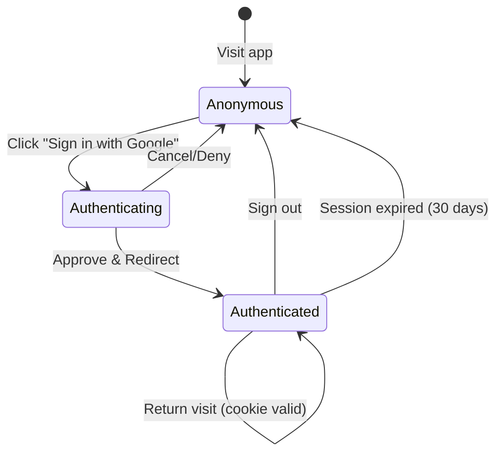
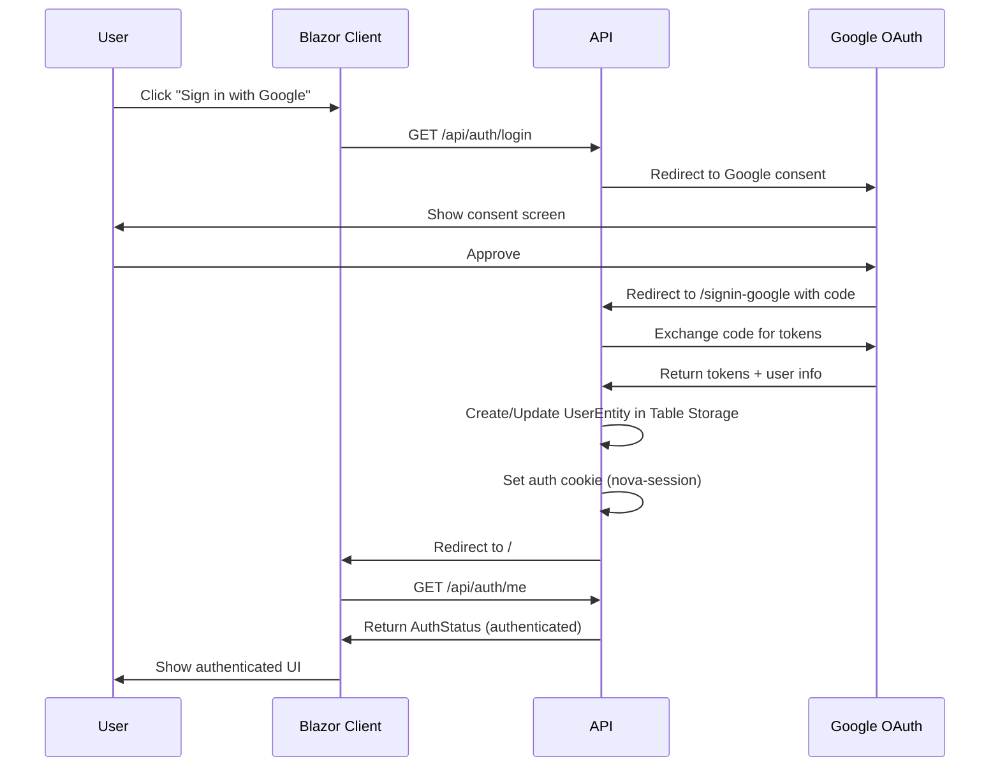

# Data Model: Google OAuth Authentication

**Feature**: 002-google-auth  
**Date**: 2025-12-11  
**Purpose**: Define entities, relationships, and validation rules

## Entities

### UserEntity (Azure Table Storage)

Represents a registered user in the system. Created on first Google sign-in.

**Table Name**: `Users`

| Field | Type | Required | Description |
|-------|------|----------|-------------|
| PartitionKey | string | ✅ | User's email address (normalized to lowercase) |
| RowKey | string | ✅ | Fixed value: `"profile"` |
| DisplayName | string | ✅ | User's display name from Google |
| PictureUrl | string | ❌ | Google profile picture URL |
| FirstLoginUtc | DateTimeOffset | ✅ | Timestamp of first sign-in |
| LastLoginUtc | DateTimeOffset | ✅ | Timestamp of most recent sign-in |
| Timestamp | DateTimeOffset | ✅ | Azure-managed timestamp |
| ETag | ETag | ✅ | Azure-managed for optimistic concurrency |

**Validation Rules**:
- `PartitionKey` (email): Must be valid email format, max 256 characters, stored lowercase
- `DisplayName`: Non-empty, max 100 characters
- `PictureUrl`: Valid HTTPS URL or null

**Relationships**:
- `UserEntity.PartitionKey` → `DailyLogEntity.PartitionKey` (one-to-many)
  - User's email links to all their daily logs

---

### UserInfo DTO (Shared)

Represents user information exposed to the client.

| Field | Type | Required | Description |
|-------|------|----------|-------------|
| Email | string | ✅ | User's email address |
| DisplayName | string | ✅ | User's display name |
| PictureUrl | string? | ❌ | Profile picture URL |

**Note**: This is a read-only DTO. No mutations from client.

---

### AuthStatus DTO (Shared)

Response from `/api/auth/me` endpoint.

| Field | Type | Required | Description |
|-------|------|----------|-------------|
| IsAuthenticated | bool | ✅ | Whether user is authenticated |
| User | UserInfo? | ❌ | User info if authenticated, null otherwise |

---

## State Transitions

### User Lifecycle



### Authentication Flow



---

## Index Strategy

Azure Table Storage uses PartitionKey + RowKey as the primary index.

| Table | PartitionKey | RowKey | Access Pattern |
|-------|--------------|--------|----------------|
| Users | email (lowercase) | "profile" | Single user lookup by email |
| DailyLogs | email (lowercase) | yyyy-MM-dd | User's logs by date range |

**Migration Note**: Existing `DailyLogs` entries use `PartitionKey = "dev-user"`. After auth is implemented, new entries will use the user's email. No migration of existing data is planned (MVP scope).

---

## Validation Implementation

### UserEntity Validation (Server-side only)

```csharp
// Email normalization happens at sign-in, before storage
public static string NormalizeEmail(string email) 
    => email.Trim().ToLowerInvariant();

// Validation happens in repository or handler
public static bool IsValidEmail(string email)
    => !string.IsNullOrWhiteSpace(email) 
       && email.Length <= 256 
       && email.Contains('@');
```

### UserInfo DTO (No client-side validation needed — read-only)

---

## Backward Compatibility

| Entity | Before | After | Migration |
|--------|--------|-------|-----------|
| DailyLogEntity.PartitionKey | `"dev-user"` | User's email | No migration — old data orphaned, new data uses email |
| AuthResult DTO | Has SessionToken | Removed | Breaking change — client updated simultaneously |
| PasscodeRequest DTO | Exists | Removed | Breaking change — endpoint removed |
